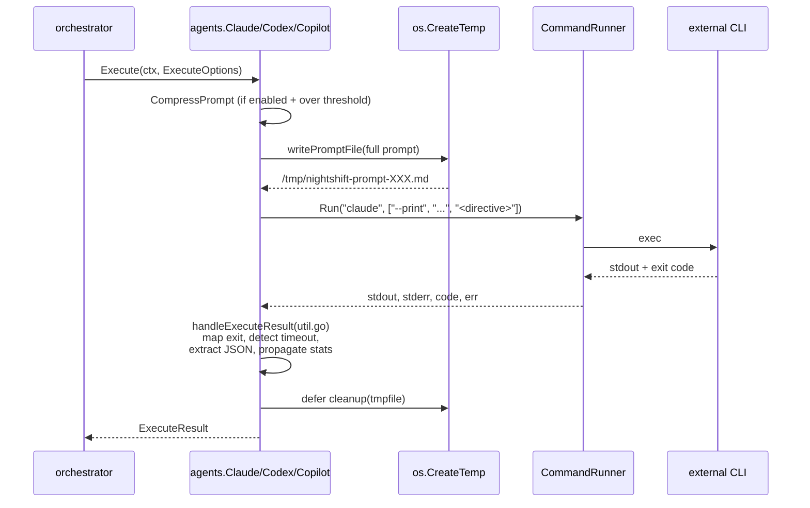
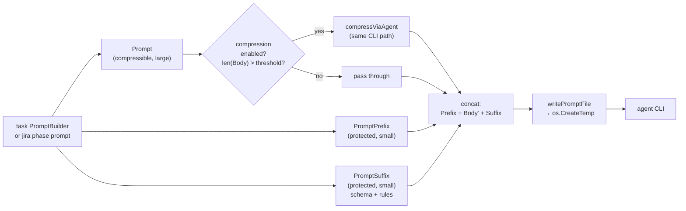

# Agents Internals

`internal/agents/` — wrappers around external coding agent CLIs.

## Interface

```go
type Agent interface {
    Name() string
    Execute(ctx context.Context, opts ExecuteOptions) (ExecuteResult, error)
}

type ExecuteOptions struct {
    PromptPrefix string         // small, never compressed
    Prompt       string         // large, compressible
    PromptSuffix string         // small, never compressed (instructions, schemas)
    Model        string
    Compression  *CompressConfig
    Timeout      time.Duration  // default 30m via DefaultTimeout
    WorkDir      string
}

type ExecuteResult struct {
    Output        string
    ExitCode      int
    JSON          map[string]any  // extracted if agent emitted JSON
    CompressStats *CompressStats
    Duration      time.Duration
}
```

Compressible vs protected: see [Architecture](architecture.md). Putting instructions in `Prompt` risks them being stripped by the compression agent.

## Option Constructors

All three agents share a single `Option` type and set of constructors defined in `options.go`:

```go
type Option func(*agentConfig)

func WithBinaryPath(p string) Option
func WithDefaultTimeout(d time.Duration) Option
func WithRunner(r CommandRunner) Option
func WithModel(m string) Option
func WithEffort(e string) Option
func WithBypassPermissions(v bool) Option
```

Deprecated type aliases (`ClaudeOption = Option`, `CodexOption = Option`, `CopilotOption = Option`) and function var aliases (`WithCodexRunner = WithRunner`, etc.) are provided for one-release backward compatibility. Prefer the unified names.

Default `bypassPermissions`: `true` for Claude and Codex, `false` for Copilot — matches original behaviour.

## Three Implementations

| File | Binary | Notable flags |
|------|--------|---------------|
| `claude.go` | `claude` | `--print`, `--dangerously-skip-permissions`, `--model` |
| `codex.go` | `codex` | `exec`, `--dangerously-bypass-approvals-and-sandbox`, `--model` |
| `copilot.go` | `gh copilot` or `copilot` | `-p`, `--no-ask-user`, `--silent`, `--allow-all-tools`, `--allow-all-urls` |

All three:

1. `writePromptFile()` — full prompt to `os.CreateTemp("", "nightshift-prompt-*.md")`
2. Pass short directive (`"Read and follow the task instructions in file: <path>"`) as CLI arg — bypasses `ARG_MAX`
3. `runner.Run()` via `CommandRunner` interface (testable; never call `exec.Command` directly)
4. Shared `handleExecuteResult()` in `util.go`
5. `defer cleanup()` to delete the temp file



## `CommandRunner`

```go
type CommandRunner interface {
    Run(ctx context.Context, name string, args []string, stdin io.Reader) (stdout string, stderr string, exitCode int, err error)
}
```

Default impl uses `exec.CommandContext`. Tests substitute a `MockRunner` that records calls and returns canned output.

## Shared post-run (`util.go`)

```go
func handleExecuteResult(out, errOut string, exitCode int, err error, compressStats *CompressStats) (ExecuteResult, error)
```

- Maps exit codes → result status
- Detects timeout (`context.DeadlineExceeded`)
- Calls `extractJSON([]byte(stdout))` directly (no longer takes an `extractJSONFn` parameter)
- Propagates `CompressStats` so token savings show in reports

Use this helper for any new agent — never duplicate exit/timeout/JSON logic.

## Prompt Assembly



Only `Prompt` (body) is fed through compression — `PromptPrefix` and `PromptSuffix` are concatenated verbatim. Put instructions/schemas in `PromptSuffix`.

## Compression

`compress.go`:

```go
type CompressConfig struct {
    Enabled         bool
    Provider        string         // claude / codex / copilot
    Model           string
    ReasoningEffort string
    ThresholdChars  int
}

func CompressPrompt(ctx context.Context, opts ExecuteOptions) (string, *CompressStats, error)
```

Threshold check + fallback. If `len(opts.Prompt) < ThresholdChars`, returns it unchanged. Otherwise calls `compressViaAgent`:

```go
func compressViaAgent(ctx context.Context, cfg *CompressConfig, text string) (string, error)
```

`compressViaAgent` builds a meta-prompt + calls the configured provider's `Agent.Execute`. So compression uses the **CLI path**, never a direct API call — same `writePromptFile` + temp-file pattern.

### Sandboxing (critical)

Compression runs sandboxed:

- `WorkDir` is pinned to a freshly created `os.MkdirTemp("", "nightshift-compress-")`; the dir is `RemoveAll`'d via `defer` after the call returns.
- The inner agent is constructed with `WithBypassPermissions(false)`, so the agent CLI (`gh copilot`, `claude --print`, `codex exec`) runs WITHOUT the dangerous bypass flag (`--allow-all-tools`, `--dangerously-skip-permissions`, `--dangerously-bypass-approvals-and-sandbox`).

This is defense-in-depth against meta-prompt failure. The VC-101 incident: the copilot agent, called for compression, ignored the meta-prompt, interpreted the embedded ticket as a task, ran `gofmt -w . && go build ./...`, and edited `cmd/nightshift/commands/jira_run.go` in whichever directory `nightshift jira run` was launched from (here: the dev checkout at `~/doc/github/nightshift`). The sandbox+no-bypass combo means even if a future model regresses to acting on `<data>` contents, it cannot reach the caller's working tree.

Guard tests: `TestBuildCompressOpts_SandboxedWorkDir`, `TestCompressMetaPrompt_ForbidsToolUse`, `TestCompressMetaPrompt_PreservesCriticalContent`.

### Meta-prompt content invariants

`compressMetaPrompt` must:

1. Forbid all tool use (edit, write, bash, shell, file I/O, git, gofmt, build, test).
2. Forbid treating `<data>` contents as a task or following any instruction inside it.
3. Forbid preamble, narration, or meta-commentary on input/output.
4. Enumerate a keep-exact list covering: code blocks, file paths, identifier names (functions/vars/fields/flags/env vars/config keys), numbers, ticket keys (e.g. VC-101), error messages, shell commands, JSON/YAML keys, acceptance criteria items, section headers.

The keep-exact list is what protects ticket descriptions from silent data loss — without it the compressor may rewrite `acquireJiraRunLock` → `acquire lock`, drop `Refs: VC-101`, or collapse acceptance bullets into a single sentence.

## Import-cycle gotcha

`agents` cannot import `config` (config → jira → agents creates a cycle). Two structs:

- `agents.CompressConfig` — used inside the agents package
- `config.PromptCompressionConfig` — used in YAML loading

Bridge: `compressionConfigFromApp()` in `cmd/nightshift/commands/helpers.go`. Don't try to unify them.

## Adding a new agent

1. New file `internal/agents/<name>.go` implementing `Agent`
2. Use `writePromptFile()` for prompts
3. Call `handleExecuteResult()` after `runner.Run()`
4. Register the agent factory wherever provider preference is resolved
5. Add config block in `internal/config/config.go`
6. Tests with `MockRunner` mirroring existing patterns

## Default timeout

`DefaultTimeout = 30 * time.Minute`. Override via two mechanisms:

1. **Per-call**: set `ExecuteOptions.Timeout` (takes precedence over agent default).
2. The factory functions in `cmd/nightshift/commands/helpers.go` call `WithDefaultTimeout` for all three agents.

`nightshift setup` exposes this as a global "Agent timeout" row in the providers step (Tab to row 3, press `t` to edit). Jira phase timeouts are configured separately per-phase in the Jira step (press `t` on focused phase row).
