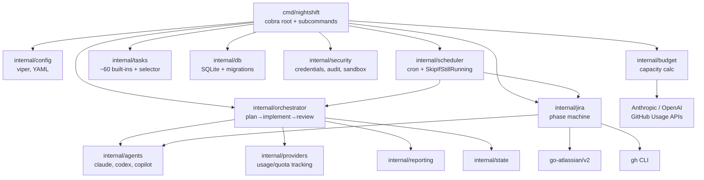
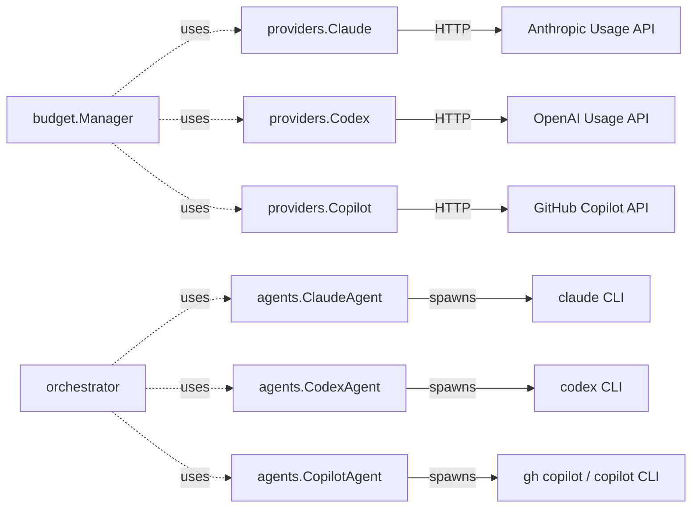
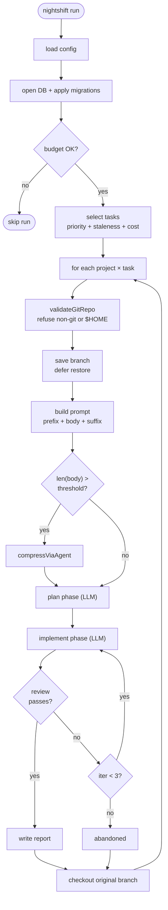
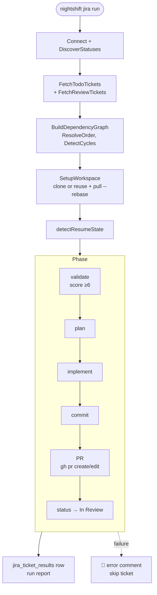
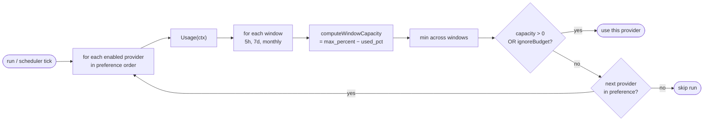

# Architecture

How Nightshift's code is organised, how a run flows end-to-end, and the key design constraints.



## High-Level Map

```
cmd/nightshift/             # CLI binary (cobra root + subcommands)
internal/
  agents/                   # Spawns external CLI binaries (claude, codex, gh copilot)
  analysis/                 # Bus-factor / code ownership analysis
  budget/                   # Budget capacity calculation
  config/                   # YAML loading via viper; the ONLY home for viper
  db/                       # SQLite + migrations; the ONLY home for raw SQL
  jira/                     # Jira autonomous pipeline (validate→plan→implement→PR)
  logging/                  # zerolog setup
  orchestrator/             # Task plan→implement→review loop
  projects/                 # Project discovery
  providers/                # Quota / usage tracking (Anthropic, OpenAI, Copilot)
  reporting/                # Run reports + daily summaries
  scheduler/                # Cron / interval wrapper
  security/                 # Credentials + audit + sandbox
  setup/                    # Setup wizard presets
  snapshots/                # Usage snapshot collector
  state/                    # Persisted RunRecord
  stats/                    # Historical aggregates
  tasks/                    # Built-in task catalog + selector
```

## Providers vs Agents

A common confusion:

| Layer | Package | Purpose |
|-------|---------|---------|
| **Providers** | `internal/providers/` | Track usage + quota via API. Three: Claude, Codex, Copilot. |
| **Agents** | `internal/agents/` | Spawn external CLI binaries. Return raw output + JSON if present. |

A provider answers "how many tokens do I have left?". An agent does the actual work. The task orchestrator uses providers for budget gating + agents for execution. The Jira orchestrator only uses agents.



## Run Lifecycle

```
nightshift run
    │
    ├── Load config (internal/config)
    ├── Open DB + apply migrations (internal/db)
    ├── Check budget — skip if exhausted (internal/budget)
    ├── Select tasks: priority + staleness + cost (internal/tasks)
    ├── For each project × task:
    │      ├── Validate workdir is a git repo, not $HOME
    │      ├── Save current branch (defer restore)
    │      ├── Build prompt: PromptPrefix + Prompt(compressible) + PromptSuffix(protected)
    │      ├── Optional: compress Prompt if > threshold
    │      ├── Plan phase (LLM)
    │      ├── Implement phase (LLM)
    │      ├── Review phase
    │      │     └── if fail and iterations < 3: retry implement
    │      ├── Write report
    │      └── Restore branch
    └── Update state, write summary
```



See [Run Lifecycle](run-lifecycle.md) for full detail.

## Jira Lifecycle

```
nightshift jira run
    │
    ├── Connect (Atlassian Cloud) + discover statuses
    ├── FetchTodoTickets — filter by label, status, sprint (optional)
    ├── BuildDependencyGraph — issuelinks, ResolveOrder, DetectCycles
    ├── For each ready ticket:
    │      ├── SetupWorkspace (clone once, reuse + git pull --rebase)
    │      ├── detectResumeState (read 🤖 nightshift comments)
    │      ├── ProcessTicket: validate→plan→implement→commit→PR→status
    │      └── PostComment after each phase
    └── FetchReviewTickets → ProcessFeedback (PR review → fix → push)
```



See [Jira Pipeline Internals](jira-pipeline.md).

## Budget Enforcement

```
fetch_usage() per provider          # Anthropic / OpenAI / GitHub APIs
  → per-window utilisation          # five_hour, seven_day, monthly_limit
  → computeWindowCapacity(window, max_percent)
  → capacity = min across windows
gate: OK = ignoreBudget || capacity > 0
```

Single config knob: `budget.max_percent` (default 90). No token arithmetic. See [Budget Internals](budget-internals.md).



## Database

SQLite at `~/.local/share/nightshift/nightshift.db` via `modernc.org/sqlite` (pure Go, no CGO).

Properties:
- WAL mode enabled (concurrent reads)
- `busy_timeout=5000`
- Foreign keys on
- Migrations auto-applied on `Open()`
- All SQL lives in `internal/db/` — nowhere else

See [Database](database.md).

## Key Design Constraints

1. **Agents are external processes** — always use the `CommandRunner` interface; never call `exec.Command` directly in agent code.
2. **Interfaces at the use site** — define interfaces in the package that uses them, not the implementor.
3. **Thin `cmd/`** — all business logic in `internal/`. `cmd/` only wires cobra commands.
4. **No `init()`** — explicit initialisation in `main` / `setup` only.
5. **Context first** — `context.Context` is the first parameter for any I/O or blocking function.
6. **One SQL home** — all SQL in `internal/db/`; no raw queries elsewhere.
7. **One config home** — all viper access in `internal/config/`.
8. **One credentials home** — all secret access in `internal/security/credentials.go`.
9. **Compressible vs protected prompts** — `Prompt` is compressible (task data); `PromptPrefix` + `PromptSuffix` are never compressed. Instructions + JSON schemas MUST go in `PromptSuffix`.
10. **Atomic PID files** — `O_CREATE|O_EXCL`; never `O_TRUNC`.
