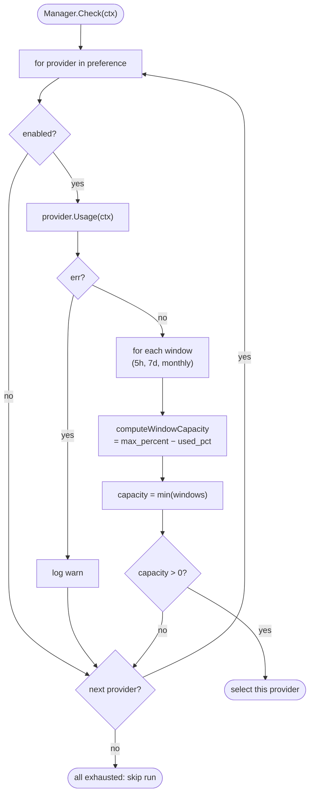

# Budget Internals

`internal/budget/budget.go` — capacity calculation + run gating.



## Interfaces

```go
type ClaudeUsageProvider interface {
    Usage(ctx context.Context) (ClaudeUsage, error)
}
type CodexUsageProvider interface {
    Usage(ctx context.Context) (CodexUsage, error)
}
// Copilot: request-count tracker, no per-token quota
```

Defined in `internal/budget`, implemented by `internal/providers/{claude,codex,copilot}.go`.

## Usage shapes

**Claude:**

```go
type ClaudeUsage struct {
    FiveHour      WindowUtilisation
    SevenDay      WindowUtilisation
    MonthlyLimit  WindowUtilisation
}
type WindowUtilisation struct {
    UsedPct       float64    // 0–100
    ResetAt       time.Time
    LimitTokens   int64
    UsedTokens    int64
}
```

**Codex:** similar shape; OpenAI returns daily + monthly buckets.

**Copilot:** monthly request count vs subscription cap.

## Capacity Formula

For each window:

```go
func computeWindowCapacity(w WindowUtilisation, maxPercent float64) float64 {
    if w.UsedPct >= maxPercent { return 0 }
    return maxPercent - w.UsedPct
}
```

Per-provider capacity = `min(windows)`. Run is allowed if `capacity > 0` for any enabled provider in `preference` order — first match wins.

## Gating

```go
ok := ignoreBudget || capacity > 0
```

`--ignore-budget` bypasses and logs a warning + audit-log entry.

## Single Knob

`budget.max_percent` (default 90). No reserve, no calibration, no token arithmetic. Earlier versions had `mode: daily|weekly`, `reserve_percent`, `billing_mode`, etc. — all removed in favour of live API checks.

## Snapshots

`internal/snapshots/collector.go` periodically calls each provider's `Usage()` and persists to the `snapshots` table. Used for `nightshift budget history` and trend visualisation.

Configure interval via daemon code (not exposed in config — fixed at 30m).

## Adding a new provider

1. Implement `Usage(ctx)` returning a struct exposing `WindowUtilisation` slots
2. Define the `<Provider>UsageProvider` interface in `internal/budget/`
3. Wire it into `Manager.checkProvider` switch
4. Surface in CLI: `nightshift budget --provider <name>`

## Edge cases

- **API down**: `Usage()` returns an error → provider skipped + warning logged. If all providers fail, the run aborts.
- **Token=0 reported but UsedPct=99**: trust `UsedPct`. The `Tokens` fields are advisory.
- **Reset just happened**: percentages drop to 0; runs resume on the next tick.

## Tests

`budget_test.go` injects stub providers via the interfaces and asserts gating decisions for representative usage shapes.
