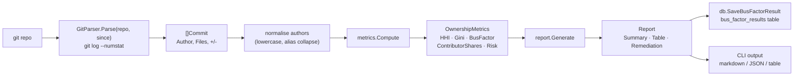

# Bus Factor Internals

`internal/analysis/` — code ownership concentration analysis.

## Pipeline



## GitParser

`analyzer.go` shells out to `git log --numstat --since=<since> --pretty=...` and parses the output. Per commit:

- Author email (preferred over name to avoid alias splits)
- Files changed
- Lines added + removed

Authors are normalised: lowercase, common typos collapsed (`<author>+suffix@gmail` → `<author>@gmail`).

## Metrics

`metrics.go`:

### Bus factor

```
busFactor = smallest k such that top-k contributors own > 50% of code
```

### HHI (Herfindahl-Hirschman Index)

```
HHI = Σ (share_i)²  × 10000
```

Where `share_i` = LOC touched by contributor i / total LOC. Range 0–10000:

- 0 = perfect distribution
- 10000 = single owner

### Gini

```
Gini = (Σ_i Σ_j |x_i - x_j|) / (2 n Σ x_i)
```

Range 0–1: 0 = equal, 1 = monopoly.

### Risk classification

| Risk | Condition |
|------|-----------|
| `critical` | busFactor ≤ 2 OR HHI > 6000 |
| `high` | busFactor ≤ 4 OR HHI > 4000 |
| `medium` | busFactor ≤ 7 OR HHI > 2500 |
| `low` | otherwise |

## Persistence

`db.go` writes a `bus_factor_results` row per analysis:

```sql
CREATE TABLE bus_factor_results (
    id INTEGER PRIMARY KEY,
    project_path TEXT NOT NULL,
    analyzed_at DATETIME NOT NULL,
    bus_factor INTEGER,
    hhi REAL,
    gini REAL,
    risk TEXT,
    contributor_count INTEGER,
    payload TEXT     -- full JSON Report for detail
);
```

`payload` stores the full report JSON for later display without re-parsing git.

## Report

`report.go` formats `OwnershipMetrics` into a `Report`:

- Summary table
- Top-N contributors with shares
- Remediation suggestions (pair contributors with thin coverage; bus-factor-targeted refactors)

Output modes: markdown (default), JSON (`--json`), terminal table.

## Tests

`analyzer_test.go` uses a temp git repo seeded with deterministic commits.

`metrics_test.go` — table-driven assertions for HHI, Gini, bus factor on synthetic ownership distributions (uniform, Pareto, monopoly).

## CLI

`cmd/nightshift/commands/busfactor.go` wires `nightshift busfactor`:

```bash
nightshift busfactor                  # all configured projects
nightshift busfactor --project ~/repo
nightshift busfactor --since 6m
nightshift busfactor --json
```

## Performance

Parsing scales linearly with `git log` size. For very large repos, use `--since` to bound the window — most ownership-concentration signal lives in the last 6–12 months.
