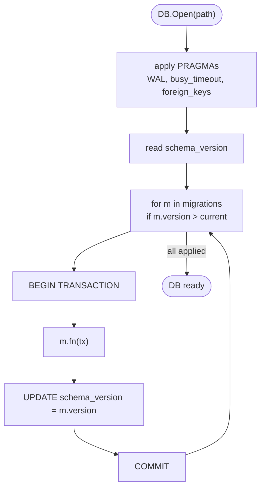

# Database

SQLite at `~/.local/share/nightshift/nightshift.db`. Driver: `modernc.org/sqlite` (pure Go, no CGO).

> **Do not switch to `mattn/go-sqlite3`** — it requires CGO. Pure Go is a hard requirement.

## Properties

- WAL mode (`PRAGMA journal_mode=WAL`) — concurrent reads while writing
- `PRAGMA busy_timeout = 5000`
- `PRAGMA foreign_keys = ON`
- Auto-migrations applied on `Open()`

## Tables

| Table | Purpose |
|-------|---------|
| `projects` | Registered project paths |
| `task_history` | Per-project task records |
| `assigned_tasks` | Currently assigned task slots |
| `run_history` | Historical runs (tokens, provider, branch, status) |
| `snapshots` | Provider usage snapshots (timestamp + utilisation) |
| `bus_factor_results` | Bus-factor analysis output |
| `jira_ticket_results` | Jira pipeline outcomes per ticket |
| `scheduler_job_failures` | Scheduler job failure history (job_name, failed_at, error_text) — migration 010 |

## Migrations



`internal/db/migrations.go` — numbered functions `migration001`, `migration002`, ... `migration010` etc. Schema version stored in `schema_version` table; `Open()` runs each pending migration in order inside a transaction.

Migrations are **forward-only** — no downs. To revert, you write a new forward migration that reverses the change.

### Adding a migration

1. Append `migrationNNN` function at the bottom of `migrations.go`
2. Register it in the `migrations` slice
3. Increment the version constant
4. Add tests (`migrations_test.go`)
5. Document in `CHANGELOG.md` if it's user-visible

Example skeleton:

```go
func migration010(tx *sql.Tx) error {
    _, err := tx.Exec(`
        ALTER TABLE run_history
        ADD COLUMN compression_savings_pct REAL DEFAULT 0;
    `)
    return err
}
```

Then:

```go
var migrations = []migration{
    {1, migration001},
    ...
    {10, migration010},
}
```

## Recent migration (009)

```sql
-- Dedup existing rows before adding constraint (prior runs could produce duplicates)
DELETE FROM jira_ticket_results
WHERE id NOT IN (
    SELECT MIN(id) FROM jira_ticket_results GROUP BY run_id, ticket_key
);
CREATE UNIQUE INDEX IF NOT EXISTS idx_jira_ticket_results_run_key
    ON jira_ticket_results(run_id, ticket_key);
```

Removes duplicate `(run_id, ticket_key)` rows that could accumulate from orchestrator restarts, then enforces uniqueness going forward. The DELETE must precede the index creation — if existing duplicates are present, `CREATE UNIQUE INDEX` fails.

## Where SQL lives

**Only in `internal/db/`.** No raw SQL anywhere else — not in `internal/jira/`, not in `cmd/`, nowhere. If you need a new query, add it as a method on `*DB` in `internal/db/db.go` (or a new file in that package).

## Inspection

```bash
sqlite3 ~/.local/share/nightshift/nightshift.db ".schema"
sqlite3 ~/.local/share/nightshift/nightshift.db "SELECT * FROM run_history ORDER BY created_at DESC LIMIT 5;"
```

## Backup

Use SQLite's online backup:

```bash
sqlite3 ~/.local/share/nightshift/nightshift.db ".backup '/tmp/ns-$(date +%F).db'"
```

Safe to run while the daemon is active.

## Import

`internal/db/import.go` — bulk-import utilities. Currently used by tests + one-off scripts.
