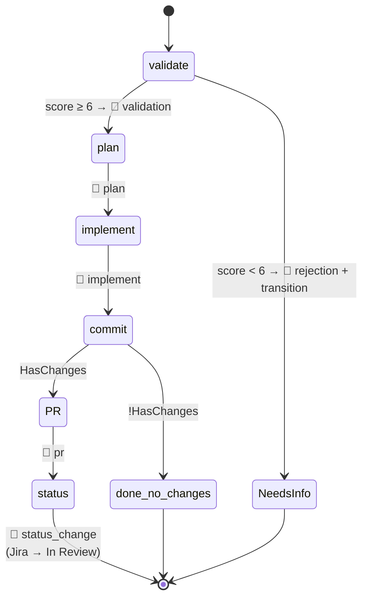
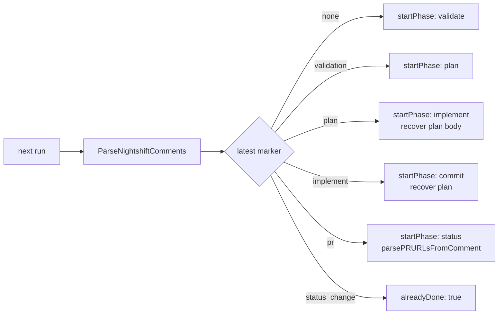
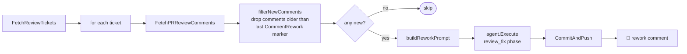

# Jira Pipeline Internals

`internal/jira/` — autonomous ticket lifecycle.

## Components

| File | Purpose |
|------|---------|
| `client.go` | `Client` wraps `go-atlassian/v2`; auth, `Ping`, `AddComment`, `discoverBoardID` (cached) |
| `config.go` | `JiraConfig`, `RepoConfig`, `PhaseConfig`; `Validate()`, `Defaults()` |
| `status.go` | `StatusMap`; `DiscoverStatuses`; `TransitionTo{InProgress,Review,Done,NeedsInfo}` |
| `tickets.go` | `Ticket`, `Comment`, `IssueLink`; `FetchTodoTickets`, `FetchReviewTickets` |
| `dependencies.go` | `BuildDependencyGraph`, `ResolveOrder`, `DetectCycles` |
| `validation.go` | LLM validation; `ValidateTicket(ctx, agent, ticket, compression)` score ≥ 6 = valid |
| `workspace.go` | `SetupWorkspace`, `CleanupStaleWorkspaces` |
| `branch.go` | `BranchName`, `CommitMessage`, `HasChanges`, `CommitAndPush` |
| `orchestrator.go` | `ProcessTicket`; phase machine; `detectResumeState` |
| `pr.go` | `CreateOrUpdatePR`, `FetchPRReviewComments`; `findExistingPR` uses `--state open` |
| `comments.go` | `PostComment`, `ParseNightshiftComments` (requires `🤖` prefix) |
| `feedback.go` | `ProcessFeedback`, `buildReworkPrompt`, `filterNewComments` (idempotency) |

## Phase Machine

`ProcessTicket` drives the phases below. `phaseOrder` is the `map[Phase]int` consulted by `skip()` so resume can leap to the right phase. Success comments are posted for validate/plan/implement/PR/status; the commit phase posts no success comment. Any failure posts a `🤖 error` comment with the phase name.



After each phase a `🤖 <!-- nightshift:type=<phase> -->` comment is posted via `PostComment` — except `commit`, which is silent.

## Resume Logic

`detectResumeState(ticket)`:

1. `ParseNightshiftComments` filters ticket comments for `🤖 <!-- nightshift:type=... -->` markers
2. Determine furthest completed phase via marker presence
3. Return resume cursor (`startPhase` + any recovered data)

`ProcessTicket` then skips already-completed phases via `skip(phase)` which compares `phaseOrder` ints.



> **Known bug (VC-84):** When a ticket has been reworked, `detectResumeState` checks `hasImpl` (CommentImplement present) before checking `hasRework`. Because the original implement comment from the first run is still present after a rework, the switch always routes to `PhaseCommit`, skipping rework re-implementation if interrupted. Fix: compare timestamps of `CommentRework` vs `CommentImplement` — if rework is newer, resume from `PhaseImplement`.

## Dependency Resolution

`BuildDependencyGraph` reads `issuelinks` (blocks/is-blocked-by). `ResolveOrder` returns a topo-sorted slice; `DetectCycles` errors out if it finds one. The pipeline processes tickets in `ResolveOrder` order.

## Validation

`ValidateTicket(ctx, agent, ticket, compression)` — calls LLM with a scoring prompt. Score ≥ 6 = valid. Invalid tickets:

```go
HandleInvalidTicket(ctx, client, ticket, score, reasons)
  → PostComment(needs-info)
  → TransitionToNeedsInfo
```

`--skip-validation` (CLI flag) passes nil agent + `WithSkipValidation()`. `ProcessTicket` permits nil `validationAgent` only when `skipValidation=true`. Preflight UI shows the phase as "skipped".

## Workspace

`SetupWorkspace(repo, ticket)`:

- First run: `git clone <ssh-url> <workspace-dir>`; `isNew=true`
- Subsequent runs: reuse existing dir; `isNew=false`
- Always: `git fetch origin && git pull --rebase origin <branch>` — even on reuse

SSH URLs required (`git@github.com:...`). HTTPS remotes fail silently in non-interactive contexts (`fatal: could not read Username`).

## Branch + commit conventions

`BranchName(ticket)` → e.g. `feature/VC-44`. `CommitMessage(...)` includes `Refs: VC-44` in body. `CommitAndPush(workspace, msg)` no-ops if `!HasChanges`.

## PR creation

`CreateOrUpdatePR(ctx, repo, ticket, plan)`:

1. `findExistingPR(repo, branch, --state open)` — `--state open` is critical; without it closed PRs match and `gh pr edit` runs on the wrong PR
2. If found → `gh pr edit`; else → `gh pr create`
3. PR body includes plan summary + ticket link

`ghExec` is a package-level var so tests can stub it.

## Feedback Handling

For tickets in review status:



`filterNewComments` drops comments older than the last `CommentRework` marker — prevents re-fixing the same feedback.

## French status names (VC project)

The VC project uses: "À faire", "En cours", "Revue en cours", "Terminé". `isReviewStatus` checks for the substring "revue" to classify "Revue en cours" correctly. `TransitionToReview` is called in `PhaseStatus` after PR creation — if anything fails before PhaseStatus, the ticket stays in "En cours".

## Sprint / Backlog Filtering

Both filters are **always active** — no config required.

**Future-sprint exclusion** — `buildTodoJQL` always appends `AND (sprint not in futureSprints() OR sprint is EMPTY)`. The `OR sprint is EMPTY` arm is required for Kanban tickets: Jira's `sprint not in futureSprints()` excludes issues with no sprint field (NULL), which silently drops all Kanban board tickets. Requires Jira Software license; Work Management projects get a JQL error at runtime.

**Backlog exclusion** — `FetchTodoTickets` calls `discoverBoardID(ctx, proj.Key)`:

1. `GET /rest/agile/1.0/board?projectKeyOrId=<KEY>` — picks first result, caches on `Client.boardCache`
2. If board found (`id > 0`): calls `fetchBoardBacklogKeys` → `GET /rest/agile/1.0/board/{id}/backlog` (paginates)
3. Subtracts backlog keys from JQL results
4. If no board found (Work Management / non-software): backlog filtering skipped gracefully; no error

Note: `GET /rest/agile/1.0/board/{id}/issue` returns ALL issues including backlog. `fetchBoardBacklogKeys` uses the `/backlog` endpoint specifically to get only the backlog subset.

**Optional:**

```yaml
projects:
  - key: VC
    require_active_sprint: true  # AND sprint in openSprints() — Jira Software only
```

`openSprints()` requires Jira Software (not Work Management). Applied only to the TODO fetch — in-flight and review tickets are never filtered.

## Workspace Restriction in Prompts

All agent prompts include a **non-compressible** workspace restriction block in `PromptSuffix`. This prevents agents from writing outside the ticket workspace directory.

**Plan phase** (`buildPlanSuffix(ws)`):
```
## WORKSPACE RESTRICTION (MANDATORY — DO NOT IGNORE)
If you need to read files to understand context, you may ONLY read files within:
  - /path/to/workspace/repo
Do NOT read or write files outside these paths.
```
Also instructs: "Do NOT edit, create, or delete any files — output plan text only."

**Implement phase** (`buildImplementSuffix(plan, ws)`):
```
## WORKSPACE RESTRICTION (MANDATORY — DO NOT IGNORE)
You MUST ONLY edit files within the workspace directories listed above.
NEVER edit, create, or delete files outside these paths under any circumstances.
Permitted paths:
  - /path/to/workspace/repo
```

Both functions live in `orchestrator.go`. The restriction is in `PromptSuffix` — never compressed. `PromptPrefix`/`PromptSuffix` bypass compression entirely; see [agents-internals](agents-internals.md).

> **Why this matters**: `claude --dangerously-skip-permissions` has unrestricted filesystem access even when `WorkDir` is set. Setting `cmd.Dir` only changes the working directory — it does not sandbox writes. Without an explicit prompt restriction, the agent can and will write to the live repo (`$HOME/...`) instead of the workspace clone.

## Testability

- `jiraClient` is an interface in `Orchestrator` (not `*Client`) — `*Client` satisfies it implicitly
- `log` field is lazily initialised inside `ProcessTicket` if nil — safe to omit in tests
- `ghExec` is a package-level var — substitute in tests
- See `e2e_test.go` — skips unless `NIGHTSHIFT_JIRA_TOKEN` is set
- See `orchestrator_test.go` for `stubJiraClient` pattern
