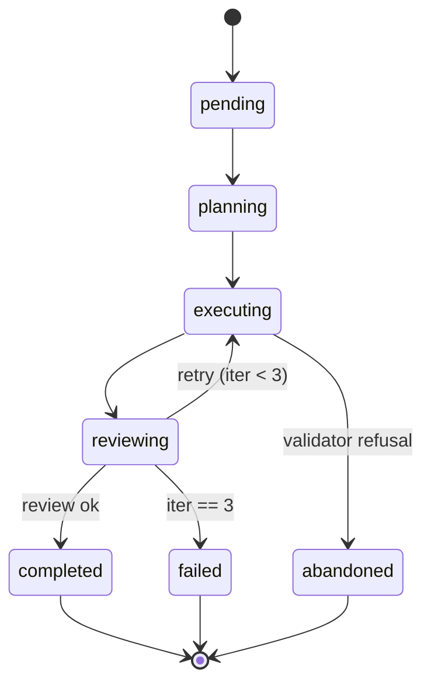

# Task Orchestrator

`internal/orchestrator/orchestrator.go` — drives one task on one project.

## Status Machine



## Construction

```go
o := orchestrator.New(cfg, db,
    orchestrator.WithMaxIterations(3),
    orchestrator.WithGitValidator(myValidator),  // testable
)
```

Options:

| Option | What |
|--------|------|
| `WithMaxIterations(n)` | Default 3 |
| `WithGitValidator(fn)` | Replace the workdir validator (tests) |
| `WithLogger(l)` | Custom zerolog logger |

## `RunTask`

```go
func (o *Orchestrator) RunTask(ctx context.Context, project, task) error
```

Pre-checks:

1. `validateGitRepo(ctx, workDir)` — refuses non-git workdirs + `$HOME`
2. `orig, _ := CurrentBranch(workDir)`; `defer checkoutBranch(workDir, orig)` — branch restore
3. `task := registry.Get(taskName)` — fail if unknown

Build the prompt:

```go
opts := agents.ExecuteOptions{
    PromptPrefix: buildPrefix(project, task),  // small, protected
    Prompt:       buildBody(project, task),    // large, compressible
    PromptSuffix: buildSuffix(task),           // schema + rules, protected
    Compression:  o.compression,
    Timeout:      task.Timeout,
}
```

Run the plan→implement→review loop:

```go
for i := 0; i < o.maxIterations; i++ {
    plan, err := o.planAgent.Execute(ctx, opts)
    if err != nil { return err }

    implOpts := withPlan(opts, plan)
    res, err := o.implementAgent.Execute(ctx, implOpts)
    if err != nil { return err }

    if o.reviewPasses(res) {
        return o.writeReport(res)
    }
}
return ErrAbandoned
```

## Branch restoration

If `CurrentBranch` returns `HEAD` (detached) or errors, no restore is attempted. Otherwise `checkoutBranch` runs unconditionally via defer — including on panic.

## Workdir validation

`validateGitRepo`:

```go
if !isGitRepo(dir)         { return fmt.Errorf("%s not in a git repo", dir) }
if root == homeDir         { return fmt.Errorf("workdir resolves to $HOME") }
```

The injectable `gitValidator` field exists for tests — replace with `func(_ context.Context, _ string) error { return nil }`.

## Event emission

`internal/orchestrator/events.go` defines event types consumed by:
- TUI (live status pane in `cmd/nightshift/commands/run_output.go`)
- Logging (`internal/logging`)

Subscribe via `o.Events()` channel; closed on `Run` return.

## Jira phase orchestrator

`internal/jira/orchestrator.go` is a separate orchestrator for Jira tickets. Same patterns (resume, branch restore) but a different phase machine. See [Jira Pipeline Internals](jira-pipeline.md).

## Testing

- `orchestrator_test.go` uses a stub task + `MockRunner` agent
- `WithGitValidator(noop)` to bypass git checks
- See [Testing](testing.md)
