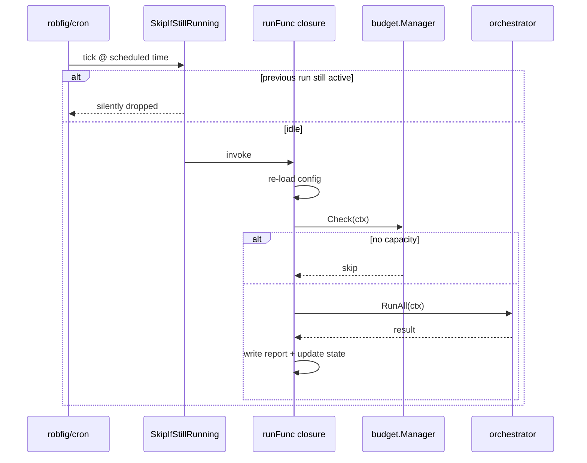

# Scheduling Internals

`internal/scheduler/scheduler.go` — wraps `robfig/cron/v3` with safety middleware.



## Construction

```go
sched := scheduler.New(cfg, runFunc)
sched.Start(ctx)
defer sched.Stop()
```

## Cron Wrapper

```go
c := cron.New(
    cron.WithChain(
        cron.SkipIfStillRunning(cron.DiscardLogger),
    ),
)
```

`SkipIfStillRunning` — if a previous fire is still running when the next is due, the next fire is silently dropped. Prevents:

- Overlapping runs hitting the same project simultaneously
- Unbounded goroutine growth on slow runs

`cron.DiscardLogger` silences the "skip" log (cron's own logger). Our zerolog logger captures the skip via the wrapped job.

## Two Modes

```yaml
schedule:
  cron: "0 2 * * *"
  # OR
  interval: "8h"
```

If both are set, `Validate()` errors out.

**Cron**: registered as a cron job.

**Interval**: wrapped as `cron.Every(interval)` to reuse the same `SkipIfStillRunning` machinery.

## Fire path

```
cron tick
  → wrapped middleware (SkipIfStillRunning)
  → runFunc(ctx)
       → orchestrator.RunAll(ctx)
```

`runFunc` is provided by the daemon and ties together budget check + task selection + orchestrator.

## Tests

`scheduler_test.go` uses an immediate-fire mock cron + a counting `runFunc` to verify:

- Single fire when not running
- Skipped fire when previous still running
- Stop signal propagation

## Daemon integration

`cmd/nightshift/commands/daemon.go` constructs the scheduler with a `runFunc` closure that:

1. Re-loads config (in case it changed between fires)
2. Checks budget
3. Selects tasks
4. Drives the orchestrator
5. Writes report + updates state

## Failure Capture (VC-96)

Job errors are now surfaced instead of silently discarded.

```
job returns error
  → Scheduler.recordFailure(ctx, jobName, err)
       → failureCounts[jobName]++           (in-memory, guarded by mu)
       → FailureSink.RecordSchedulerFailure (if wired)
            → log.Errorf(...)               (daemon wires schedulerFailureSink)
            → db.RecordSchedulerFailure(...)  (persists to scheduler_job_failures table)
```

### FailureSink interface

```go
type FailureSink interface {
    RecordSchedulerFailure(ctx context.Context, jobName string, failedAt time.Time, errText string)
}
```

Scheduler stays decoupled from `internal/db` and `internal/logging`. The sink is wired in `cmd/nightshift/commands/daemon.go` via `sched.WithFailureSink(...)`.

### Named jobs

`AddNamedJob(name, job)` registers a job with an explicit name used in failure records.
`AddJob(job)` (deprecated) auto-names as `job-0`, `job-1`, etc. for back-compat.

The daemon registers the main job as `"scheduled-run"`.

### Health surface

- `nightshift status` — shows last failure per job (timestamp + message) when any exist.
- `nightshift doctor` — checks failures within N scheduled intervals (configurable via `scheduler.unhealthy_failure_count`, default 3):
  - **FAIL**: ≥ N failures within the window.
  - **WARN**: 1–(N-1) failures within the window, or past failures outside the window.
  - **OK**: no failures.

### DB table

`scheduler_job_failures` (migration 010):

| column     | type    | notes                |
|------------|---------|----------------------|
| id         | INTEGER | PK autoincrement     |
| job_name   | TEXT    | named job identifier |
| failed_at  | DATETIME | UTC RFC3339Nano      |
| error_text | TEXT    | err.Error() string   |

Index on `(job_name, failed_at DESC)` for fast last-failure and count-since queries.

## Gotchas

- Config changes do not require a daemon restart — `runFunc` re-loads on each fire.
- Schedule changes (cron/interval) DO require restart — the cron job is registered once.
- `SkipIfStillRunning` is on the cron instance, not per-job — registering multiple jobs would need refactoring.
- `failureCounts` is in-memory only — resets on daemon restart. Persistent counts come from the DB via `CountSchedulerFailuresSince`.
- Sink errors (e.g. DB write failure) are logged by the sink itself and do not propagate into the scheduler — job failure is already recorded in the counter even if the sink fails.
