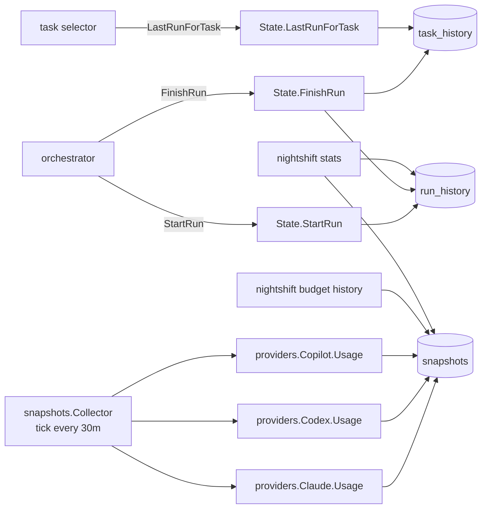

# State & Snapshots

Two persistence layers above the DB:

- **State** (`internal/state/`) — current + recent run metadata; concurrency-safe
- **Snapshots** (`internal/snapshots/`) — periodic provider usage capture



## State

`State` struct wraps the DB with a `sync.RWMutex` for in-process coordination.

```go
type State struct {
    mu sync.RWMutex
    db *db.DB
}

type RunRecord struct {
    RunID      string
    Project    string
    Task       string
    Provider   string
    StartedAt  time.Time
    FinishedAt time.Time
    Status     string         // running | completed | failed | abandoned
    TokensIn   int64
    TokensOut  int64
    Branch     string
    PRURL      string
    Error      string
}
```

Operations:

```go
func (s *State) StartRun(ctx context.Context, rec RunRecord) error
func (s *State) FinishRun(ctx context.Context, runID string, rec RunRecord) error
func (s *State) RecentRuns(ctx context.Context, n int) ([]RunRecord, error)
func (s *State) LastRunForTask(ctx context.Context, project, task string) (RunRecord, error)
```

`LastRunForTask` drives the staleness check in the task selector — it determines whether a task is past its cooldown interval.

## Staleness

For a project + task:

```
last := state.LastRunForTask(project, task)
elapsed := time.Since(last.FinishedAt)
if elapsed < task.Interval {
    skip  // still in cooldown
}
```

## Snapshots

`internal/snapshots/collector.go`:

```go
type Collector struct {
    interval time.Duration
    providers []provider
    db *db.DB
}

func (c *Collector) Run(ctx context.Context) error
```

Loop:

```
ticker := time.NewTicker(c.interval)   // 30m
for {
    select {
    case <-ctx.Done(): return nil
    case <-ticker.C:
        for _, p := range c.providers {
            u, err := p.Usage(ctx)
            ...
            c.db.InsertSnapshot(p.Name(), u, time.Now())
        }
    }
}
```

Stored to `snapshots` table.

## Retention

Snapshots are not auto-pruned. Trim manually:

```sql
DELETE FROM snapshots WHERE created_at < datetime('now','-90 days');
VACUUM;
```

## Consumed by

- `nightshift budget history` — recent provider utilisation
- `nightshift stats` — historical aggregates
- Daily summary reports

## Concurrency Guarantees

- `State` uses `sync.RWMutex` for in-process safety
- The DB layer uses SQLite WAL + `busy_timeout=5000` for cross-process safety
- All writes inside transactions

## Migration Note

Older versions stored state in `state/state.json`. On startup, if that file exists, Nightshift imports it to SQLite and renames the file to `state.json.migrated`. No further action required.
