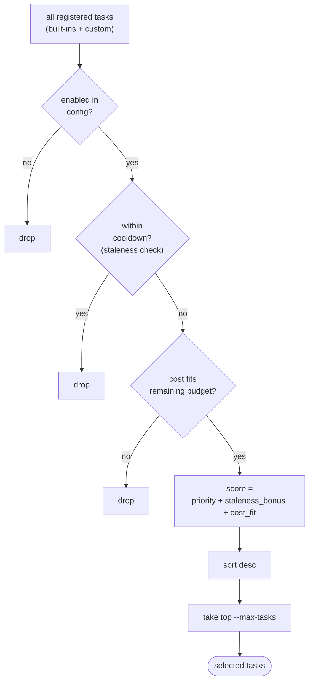

# Tasks Internals

`internal/tasks/` — task catalog, registration, selector.

## `TaskDefinition`

```go
type TaskDefinition struct {
    Type        string         // unique slug (e.g. "lint-fix")
    Category    TaskCategory   // pr | analysis | options | safe | map | emergency
    Name        string         // human-friendly title
    Description string
    CostTier    CostTier       // Low | Medium | High | VeryHigh
    RiskLevel   RiskLevel
    Interval    time.Duration  // default cooldown between runs on same project
    PromptBuilder func(project) (Prompt, error)
}
```

## Categories

| Category | Meaning |
|----------|---------|
| `pr` | Produces a PR (lint, docs, tests, refactors) |
| `analysis` | Read-only investigation; writes a report |
| `options` | Generates multiple alternative approaches |
| `safe` | Low-risk hygiene |
| `map` | Repo-wide indexing |
| `emergency` | Critical fixes (security, broken builds) |

## Cost Tiers

| Tier | Approx tokens | Default cooldown |
|------|---------------|------------------|
| `Low` | < 5k | 24h |
| `Medium` | 5k–25k | 72h |
| `High` | 25k–100k | 168h |
| `VeryHigh` | > 100k | 336h |

## Registration

Built-in tasks live in `tasks.go`, registered eagerly at package init. Custom tasks come from config:

```go
func RegisterCustomTasksFromConfig(cfg config.Config) error
```

Rolls back on any failure — either all custom tasks register or none do.

## Selector



`internal/tasks/selector.go`:

```go
func Select(ctx context.Context, available []TaskDefinition, project Project, state State, budget BudgetInfo, opts SelectOptions) ([]TaskDefinition, error)
```

Filtering:

1. Drop disabled
2. Drop tasks within their interval cooldown
3. Drop tasks exceeding remaining budget

Scoring:

```
score = priority + staleness_bonus + cost_fit
```

- `priority`: from `tasks.priorities[name]` (lower = higher priority; inverted in scoring)
- `staleness_bonus`: hours since last run / interval
- `cost_fit`: penalty if cost tier doesn't match remaining budget

Top N by score. `--random-task` skips scoring and picks uniformly.

## Built-in Catalog

~60 tasks. Examples by category:

- **pr**: `lint-fix`, `docs-backfill`, `unused-import-cleanup`, `test-coverage-gaps`
- **analysis**: `bug-finder`, `security-audit`, `dependency-audit`
- **options**: `refactor-suggestions`, `architecture-options`
- **safe**: `whitespace-fix`, `gofmt-only`
- **map**: `repo-index`, `dependency-map`
- **emergency**: `broken-build-fix`, `cve-patch`

Full list: `nightshift task list`.

## Adding a built-in task

1. Define a `TaskDefinition` literal in `tasks.go`
2. Provide a `PromptBuilder` that returns:
   - small protected `Prefix`
   - large compressible `Body` (file context, repo state)
   - small protected `Suffix` (output schema, behavioural rules)
3. Append to the package-level `BuiltIns` slice

If your task needs new context plumbing (e.g. reading a specific config file), add a helper in `tasks.go` or a sibling file — not a new package.

## Adding a custom task (user)

```yaml
custom_tasks:
  - name: my-task
    category: pr
    cost: medium
    risk: low
    interval: 48h
    description: "Custom thing"
    prompt: |
      ...
```

`RegisterCustomTasksFromConfig` converts this YAML into a `TaskDefinition` with a closure `PromptBuilder` that returns the static prompt.

## Tests

`tasks_test.go`, `selector_test.go` — table-driven coverage of scoring, filtering, and registration rollback.
