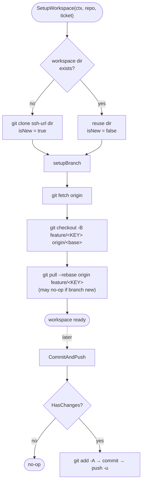

# Workspace Management

`internal/jira/workspace.go` — clone, branch, push for the Jira pipeline.



## Layout

```
~/.local/share/nightshift/workspaces/
  <repo-name>/
    .git/
    ... working tree ...
```

One workspace per repo; reused across tickets.

## Setup

```go
ws, err := SetupWorkspace(ctx, repo, ticket)
```

Logic:

1. If `<workspace-dir>` does not exist → `git clone <ssh-url> <dir>`; `isNew = true`
2. Else → reuse; `isNew = false`
3. Always: `setupBranch(ws, ticket)`

`setupBranch` does:

```
git fetch origin
git checkout -B feature/<TICKET-KEY> origin/<base-branch>
git pull --rebase origin feature/<TICKET-KEY>     # sync if branch already exists remotely
```

## SSH Required

Repos must use `git@github.com:...`. HTTPS remotes fail silently in non-interactive contexts (`fatal: could not read Username`). The config validator does not currently reject HTTPS URLs — but the run will hang or fail mysteriously, so set SSH explicitly.

## Branch Naming

`BranchName(ticket)`:

```
feature/<TICKET-KEY>
```

E.g. `feature/VC-42`. Always rooted at `feature/`.

## Commit Message

`CommitMessage(ticketKey, issueType, scope, description)`:

```
<type>(<scope>): <summary>

<body>

Refs: <TICKET-KEY>
```

`type` is inferred from the ticket type (Bug → fix, Story → feat, etc.).

## Push

`CommitAndPush(ws, msg)`:

1. `HasChanges(ws)` — if no diff, no-op + return false
2. `git add -A`
3. `git commit -m <msg>`
4. `git push -u origin feature/<TICKET-KEY>`

## Cleanup

`CleanupStaleWorkspaces(cfg)` — removes workspace dirs whose newest file activity (across all contained files and subdirs) is older than `cfg.CleanupAfterDays` days. Called at the start of each `nightshift run`.

**Staleness is determined by walking the entire workspace directory tree** and taking the newest mtime found among all entries. The workspace directory entry's own mtime is not used alone, because on Linux, git operations (clone, fetch, checkout, file writes) update file mtimes inside a directory without updating the directory entry's own mtime. Using the directory mtime alone would cause active workspaces to be falsely deleted.

## Resume semantics

Because workspaces are reused, a partial run leaves edits in the working tree. On resume:

1. `setupBranch` syncs to remote (which may not yet have the partial commit) — partial uncommitted edits remain in the working tree.
2. `detectResumeState` reads ticket comments to find the resume point.
3. Phases run from that point. If the implement phase had already partially edited the tree, those edits may still be present, which is fine — the agent will see them as starting state.

For a true clean slate, move the ticket back to TODO and let `CleanupStaleWorkspaces` clear the dir, or manually `rm -rf <workspace>`.

## Testability

`workspace_test.go` uses a temp dir + a stub `git` executable wrapper. The `Run` function for git commands is a package-level var; substitute in tests.

---

## Task-isolation workspace (`internal/workspace`)

**Note**: This is a separate workspace system from the Jira pipeline workspace described above.

`internal/workspace` manages clone-based isolated working directories for task runs configured via `workspace.root` + `workspace.repos` in the YAML config.

### Workspace mode

When `workspace.root` is set, `nightshift run` clones repos into fresh workspaces before executing tasks:

- `nightshift run` → `workspacedRun()` in `cmd/nightshift/commands/run.go`

### State key

In workspace mode, the **repo name** (`workspace.repos[*].name`) is used as the state key for cooldown and staleness tracking — not the UUID-suffixed clone path. This ensures cooldowns persist across runs even though each run creates a fresh clone directory.

### Per-repo task filter

`workspace.repos[*].tasks` lists allowed task types for that repo. When set, `runRepoTasks` filters out tasks not in the list before execution. Empty/nil means no filter (all enabled tasks are eligible).

### Exported test helper

`workspace.SetGitExecFn(fn)` replaces the internal git executor and returns the previous function for `defer`-based restoration. Used in tests to avoid real git clones.
