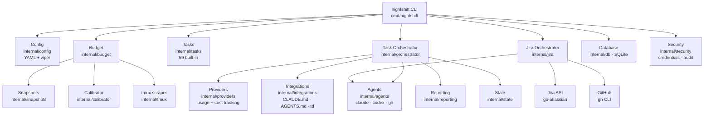
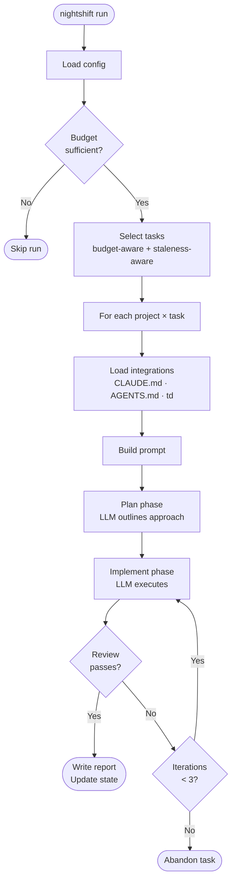
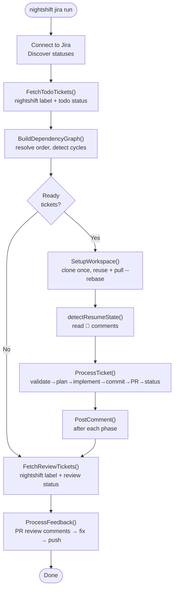

# Architecture Overview

This guide describes Nightshift's internal architecture: how the major packages relate, how a run flows end to end, and key design decisions.

---

## High-Level Architecture

---

## Providers vs Agents

These are distinct layers that are often confused:

| Layer | Package | Purpose |
|-------|---------|---------|
| **Providers** | `internal/providers/` | Track usage and cost. Have API access. Three: Claude, Codex, Copilot. |
| **Agents** | `internal/agents/` | Spawn external CLI binaries (`claude`, `codex`, `gh copilot`). Return raw output. |

A provider tracks how many tokens were used and at what cost. An agent is what actually runs. The Jira orchestrator uses agents exclusively; the task orchestrator uses providers for budget tracking and agents for execution.

---

## Task Run Lifecycle

The task orchestrator (`internal/orchestrator/orchestrator.go`) coordinates this with a plan → implement → review loop (up to `DefaultMaxIterations=3`).

---

## Jira Ticket Lifecycle

See `docs/guides/jira-pipeline.md` for detailed phase descriptions.

---

## Budget Calculation

Budget is computed in `internal/budget/budget.go`:

1. **Snapshot** — collect local token counts + (if tmux available) scrape usage %
2. **Calibrate** — infer total budget: `inferred = local_tokens / (scraped_pct / 100)`
3. **Calculate available**:
   - Daily mode: `available = (weekly_budget / 7) * (1 - reserve_percent/100)` × `max_percent/100`
   - Weekly mode: `available = remaining_weekly * max_percent/100`
4. **Aggressive end-of-week** (if enabled): multiply by 2× (≤2 days left) or 3× (last day)

Budget is checked before each run. If insufficient, the run is skipped.

---

## Configuration Loading

All config access goes through `internal/config/config.go`. Key rules:

- Viper loads: global `~/.config/nightshift/config.yaml` → per-project `nightshift.yaml`
- `cfg.Jira.Defaults()` is called during load to fill in per-phase provider/model/timeout defaults
- Paths containing `~/` are expanded via `expandPath()` helpers
- Never call viper directly outside `internal/config/`

---

## Database Layer

SQLite at `~/.local/share/nightshift/nightshift.db` via `modernc.org/sqlite` (pure Go, no CGO).

Tables:
- `projects` — registered project paths
- `task_history` — per-project task run records (last run, outcome)
- `assigned_tasks` — current task assignments
- `run_history` — historical runs with token counts, provider, branch
- `snapshots` — token usage snapshots for calibration
- `bus_factor_results` — code ownership analysis results

Key properties:
- WAL mode enabled (concurrent reads)
- 5s busy timeout
- Foreign keys on
- Migrations applied automatically on `Open()` via `migrations.go`
- All SQL lives in `internal/db/` — no raw SQL anywhere else

---

## Security Model

- **Credentials**: env vars only. `CredentialManager` reads `ANTHROPIC_API_KEY`, `OPENAI_API_KEY`. Never from config files.
- **Config scanning**: `CheckConfigForCredentials` scans config YAML for patterns like `sk-`, `token:`, `password:`, `secret:`. Returns an error if found.
- **Audit log**: append-only JSONL at `~/.local/share/nightshift/audit/audit-YYYY-MM-DD.jsonl`. Permissions 0700. Captures: agent_start/complete/error, file_read/write/delete, git_commit/push, security_check/denied, config_change, budget_check.
- **Sandbox**: `internal/security/sandbox.go` applies execution restrictions for agent processes.

---

## Integrations

The `internal/integrations/` package provides a `Reader` interface for external context/task sources:

- `ClaudeMDReader` — reads `CLAUDE.md` from project root; enabled by `integrations.claude_md: true`
- `AgentsMDReader` — legacy; reads `AGENTS.md`; returns nil if absent (not an error)
- `TDReader` — reads tasks from the `td` CLI
- `GitHubReader` — reads GitHub issues labeled `nightshift`

All readers return `nil` (not an error) when the source doesn't exist.

---

## Key Design Constraints

1. **Agents are external processes** — always use `CommandRunner` interface; never call `exec.Command` directly
2. **Interfaces at the use site** — define interfaces in the package that uses them, not the implementor
3. **`cmd/` is thin** — all business logic lives in `internal/`
4. **No `init()` functions** — explicit initialization only
5. **Context first** — `context.Context` is the first parameter for any I/O function
6. **One SQL home** — all SQL in `internal/db/`; no raw queries elsewhere
7. **One config home** — all viper access in `internal/config/`
8. **One credentials home** — all secret access in `internal/security/credentials.go`
