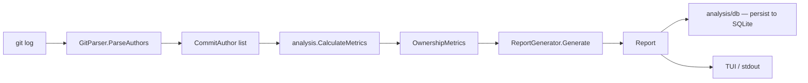

# Bus-Factor Analysis Internals

How `nightshift busfactor` measures code ownership concentration and surfaces
knowledge-silo risk.

## Packages

| Package | Responsibility |
|---------|---------------|
| `internal/analysis/analyzer.go` | `GitParser` — extracts commit history |
| `internal/analysis/metrics.go` | `OwnershipMetrics` — HHI, Gini, bus factor, risk |
| `internal/analysis/report.go` | `ReportGenerator` — formats results |
| `internal/analysis/db.go` | Persists analysis results to SQLite |

## Data Flow



## GitParser

```go
type GitParser struct { repoPath string }

type ParseOptions struct {
    Since    time.Time
    Until    time.Time
    FilePath string  // narrow to a subtree
}
```

`ParseAuthors` runs:

```
git log --format=%an|%ae [--since=...] [--until=...] [-- filePath]
```

Deduplication: authors are merged by `Name|Email` key. Email-only aliases
(same email, different display names) are counted as the same person.

### CommitAuthor

```go
type CommitAuthor struct {
    Name    string
    Email   string
    Commits int
}
```

## Metrics Calculation

### Bus Factor

The minimum number of contributors whose combined commits account for ≥50%
of all commits.

```
threshold = total_commits × 0.5
bus_factor = smallest N such that top-N commits ≥ threshold
```

A bus factor of 1 means a single developer wrote more than half the code.

### Herfindahl-Hirschman Index (HHI)

Measures market concentration. Originally used in antitrust economics, adapted
here for commit share:

```
HHI_raw = Σ (commits_i / total)²
```

Normalised to 0–1:

```
HHI = (HHI_raw − 1/n) / (1 − 1/n)
```

- `0` = all contributors have equal share
- `1` = one contributor owns everything

### Gini Coefficient

Classic inequality measure (income distribution applied to commit share):

```
Gini = (2 × Σ (rank_i × commits_i)) / (n × total) − (n+1)/n
```

- `0` = perfect equality
- `1` = perfect inequality

### Top-N Percentages

`Top1Percent`, `Top3Percent`, `Top5Percent` are the fraction of all commits
owned by the top 1, 3, or 5 contributors respectively.

## Risk Level

```go
func assessRiskLevel(hIndex, top1Percent float64, numContributors int) string
```

| Level | Conditions |
|-------|------------|
| `critical` | Top contributor > 80% of commits **OR** total contributors ≤ 1 |
| `high` | Top contributor > 50% **OR** total contributors ≤ 2 |
| `medium` | HHI > 0.3 **OR** total contributors ≤ 5 |
| `low` | None of the above |

A numeric score for programmatic use:

| Level | Score |
|-------|-------|
| `critical` | 75 |
| `high` | 50 |
| `medium` | 25 |
| `low` | 0 |
| unknown | -1 |

## OwnershipMetrics

```go
type OwnershipMetrics struct {
    HerfindahlIndex   float64  // normalised 0–1
    GiniCoefficient   float64  // 0–1
    Top1Percent       float64  // e.g. 63.2
    Top3Percent       float64
    Top5Percent       float64
    RiskLevel         string   // low | medium | high | critical
    TotalContributors int
    BusFactor         int      // contributors needed to reach 50% of commits
}
```

Human-readable summary via `.String()`:

```
Contributors: 4 | Bus Factor: 1 | Top 1: 78.3% | Risk: high | HHI: 0.621
```

## Report Generation

`ReportGenerator.Generate` wraps the metrics in a `Report` struct with
metadata (repo path, date range, scan options). The `nightshift busfactor`
command prints this via the lipgloss TUI renderer or plain text (`--plain`).

## Persistence

`analysis/db.go` stores each analysis result in the `bus_factor_runs` table
(added by a migration in `internal/db/migrations.go`). Stored fields include
the repo path, timestamp, HHI, Gini, bus factor count, and risk level.
Historical results are used by `nightshift stats` to show trend lines.

## CLI

```bash
# Analyse the current repo
nightshift busfactor

# Analyse a specific directory
nightshift busfactor --path /path/to/repo

# Filter to a subtree (e.g. only changes to the API layer)
nightshift busfactor --file internal/api/

# Filter by date range
nightshift busfactor --since 2024-01-01 --until 2024-12-31

# Plain text output (no TUI)
nightshift busfactor --plain
```

## Limitations

- **Merge commits** inflate the author who performs merges. Use
  `--no-merges` filtering if your team uses merge-heavy workflows (not yet a
  flag — add to `ParseOptions` if needed).
- **Squash merges** attribute every commit in a PR to a single author,
  which may overstate that author's share.
- **Email aliasing** — a contributor who pushes from two different email
  addresses is counted as two people. Normalise with `.mailmap` at the repo
  root.
