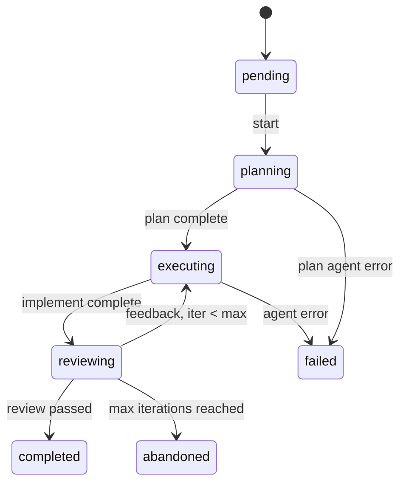

# Orchestrator Internals

Nightshift has two orchestrators with different scopes:

| Orchestrator | Package | Scope |
|-------------|---------|-------|
| Task orchestrator | `internal/orchestrator/` | Runs coding tasks (plan→implement→review loop) |
| Jira orchestrator | `internal/jira/` | Implements Jira tickets (validate→plan→implement→commit→PR→status) |

---

## Task Orchestrator

### State machine



Status constants:

```go
const (
    StatusPending   TaskStatus = "pending"
    StatusPlanning  TaskStatus = "planning"
    StatusExecuting TaskStatus = "executing"
    StatusReviewing TaskStatus = "reviewing"
    StatusCompleted TaskStatus = "completed"
    StatusFailed    TaskStatus = "failed"
    StatusAbandoned TaskStatus = "abandoned"
)
```

`DefaultMaxIterations = 3`. Each full plan→implement→review cycle is one iteration. If the review agent fails 3 times, the task is `abandoned` (not `failed` — abandoned means the agent tried but couldn't succeed, failed means infrastructure error).

### The plan→implement→review loop

```
1. Plan agent   → produces PlanOutput (steps, files, description)
2. Implement agent → reads plan + project files → writes code
3. Review agent → reads implementation → passes or gives feedback
4. If review fails and iters < max: go to 2 with feedback injected
```

The plan is injected into the implement prompt as a structured section. Review feedback is injected into the next implement prompt so the agent knows what to fix.

### Events

The orchestrator emits `Event` values to a registered `EventHandler` during execution. This feeds the TUI (live output) and logging:

```go
type Event struct {
    Type      EventType    // Start, PhaseStart, PhaseEnd, IterationStart, Log, End
    Phase     TaskStatus   // current phase
    Iteration int          // 1-based
    MaxIter   int
    TaskID    string
    TaskTitle string
    Message   string
    Level     string       // "info", "warn", "error"
    Fields    map[string]any
    Status    TaskStatus   // final status (EventTaskEnd)
    Duration  time.Duration
    Error     string
}
```

Register a handler:

```go
o.SetEventHandler(func(e orchestrator.Event) {
    // render to TUI or log
})
```

---

## Jira Orchestrator

### Phase lifecycle

Each ticket goes through up to 6 phases in order:

```go
const (
    PhaseValidate  Phase = "validate"
    PhasePlan      Phase = "plan"
    PhaseImplement Phase = "implement"
    PhaseCommit    Phase = "commit"
    PhasePR        Phase = "pr"
    PhaseStatus    Phase = "status"
)
```

`phaseOrder` map defines the numeric order used by `detectResumeState` to find the furthest completed phase.

### Resume logic

`detectResumeState(ctx, ticketKey)` reads all `🤖` comments from the Jira ticket, parses their `CommentType`, and returns the furthest phase that has already completed. `ProcessTicket` then calls `skip(phase)` for anything at or before that point.

```
Comment type "plan" found → resume from implement
Comment type "commit" found → resume from pr
```

### Injected function fields

Five functions are assigned before `ProcessTicket` runs to allow test substitution without subprocesses:

```go
o.fnHasChanges   = HasChanges       // git diff check
o.fnCommitAndPush = CommitAndPush   // git commit + push
o.fnCreatePR     = CreateOrUpdatePR // gh pr create
o.fnFindPR       = findExistingPR   // gh pr list
o.fnFetchReviews = FetchPRReviewComments
```

Override in tests:

```go
o.fnHasChanges = func(ws RepoWorkspace) (bool, error) { return true, nil }
o.fnCommitAndPush = func(...) error { return nil }
```

### `jiraClient` interface

`Orchestrator` holds `jiraClient` (interface), not `*Client` (concrete). `*Client` satisfies the interface implicitly. This pattern allows `stubJiraClient` in tests.

Interface methods:
- `PostComment(ctx, ticketKey, NightshiftComment) error`
- `HandleInvalidTicket(ctx, ticketKey, *ValidationResult) error`
- `TransitionToInProgress(ctx, issueKey) error`
- `TransitionToReview(ctx, issueKey) error`

### Error vs result semantics

`ProcessTicket` returns `(TicketResult, error)`:
- `error != nil` — infrastructure failure (missing agent binary, network unreachable)
- `error == nil, result.Status == "failed"` — the ticket pipeline failed (implement produced no changes, PR creation error, etc.)

Callers should check `result.Status` even when `err == nil`.

---

## `ghExec` package-level var

`internal/jira/pr.go` exposes:

```go
var ghExec = func(args ...string) (string, error) { ... }
```

This is the single point of injection for all `gh` CLI calls in the PR subsystem. Tests substitute it to avoid real `gh` invocations. It is not exported — tests in `package jira` can access it directly.

Do not add additional `exec.Command` calls in `internal/jira/` — route all `gh` calls through `ghExec`.
