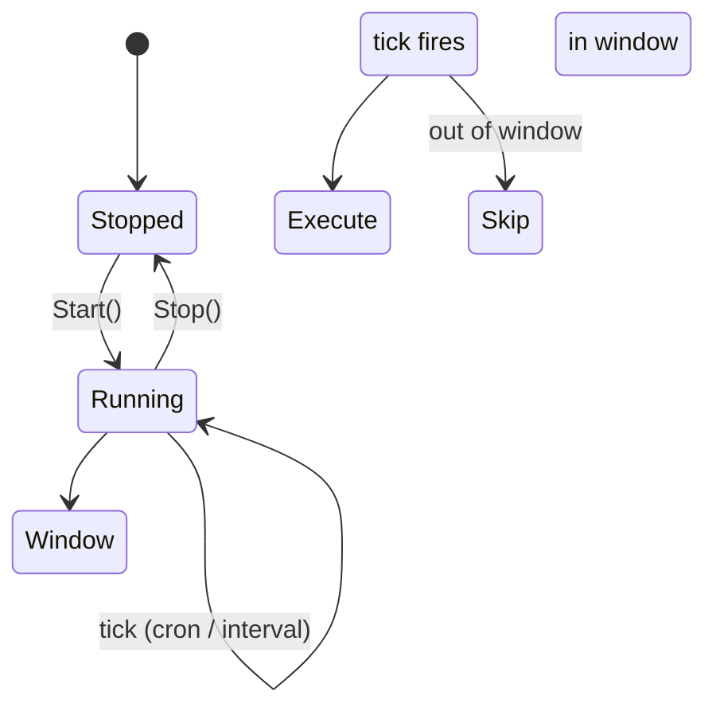

# Scheduling Internals

How `nightshift daemon` and the scheduler work internally.

---

## Overview

Nightshift can run on a schedule via two mechanisms:

| Mode | Config key | Example |
|------|-----------|---------|
| Cron expression | `schedule.cron` | `"0 2 * * *"` (2 AM daily) |
| Fixed interval | `schedule.interval` | `"6h"` |

Only one may be set at a time — setting one clears the other.

---

## Daemon Mode

```bash
nightshift daemon start   # fork and detach; writes PID to ~/.local/share/nightshift/nightshift.pid
nightshift daemon stop    # send SIGTERM to the PID file process
nightshift daemon status  # print running / stopped + next run time
```

The daemon writes its PID to:
```
~/.local/share/nightshift/nightshift.pid
```

On `daemon start`, nightshift forks a detached child process. The parent exits immediately after confirming the child started. On `daemon stop`, the PID file is read and `SIGTERM` is sent to the process.

---

## Scheduler Internals (`internal/scheduler/scheduler.go`)

`Scheduler` wraps `robfig/cron/v3` for cron mode and a custom `intervalLoop` goroutine for interval mode.



### Cron mode

`cron.New()` is configured with the 5-field standard parser (`Minute | Hour | Dom | Month | Dow`). The scheduler registers a single `AddFunc` entry. `Stop()` calls `cron.Stop()` and waits for `doneCh` (max 30s timeout).

### Interval mode

A goroutine runs a `time.Timer` loop:
1. Fire → run all jobs → compute next run → reset timer
2. Exits on `ctx.Done()` or `stopCh`

### Time windows

If `schedule.window` is configured, `runJobs` checks `IsInWindow(now)` before executing. Out-of-window ticks are silently skipped. Overnight windows (e.g. `22:00–06:00`) are handled correctly:

```go
// Overnight: start > end — valid if after start OR before end
if startMins > endMins {
    return currentMins >= startMins || currentMins < endMins
}
```

---

## Config Reference

```yaml
schedule:
  cron: "0 2 * * *"      # Standard 5-field cron (minute hour dom month dow)
  # interval: "6h"        # Alternative: fixed interval (cannot use both)
  window:
    start: "22:00"        # Start of allowed window (HH:MM)
    end:   "06:00"        # End of allowed window (overnight OK)
    timezone: "Europe/Paris"  # IANA timezone (default: local)
```

Common cron expressions:

| Expression | Meaning |
|-----------|---------|
| `0 2 * * *` | Every day at 2 AM |
| `0 22 * * 1-5` | Weeknights at 10 PM |
| `0 */6 * * *` | Every 6 hours |
| `0 3 * * 0` | Every Sunday at 3 AM |

---

## Manual Trigger

Run immediately regardless of schedule:

```bash
nightshift run                          # all tasks for all projects
nightshift run --project /path/to/repo  # specific project
```

---

## Previewing the Schedule

```bash
nightshift preview          # show what would run + estimated cost
nightshift daemon status    # show next scheduled run time
```

`Scheduler.NextRuns(n)` computes the next N run times without starting the scheduler — used by `nightshift preview` and `daemon status`.
