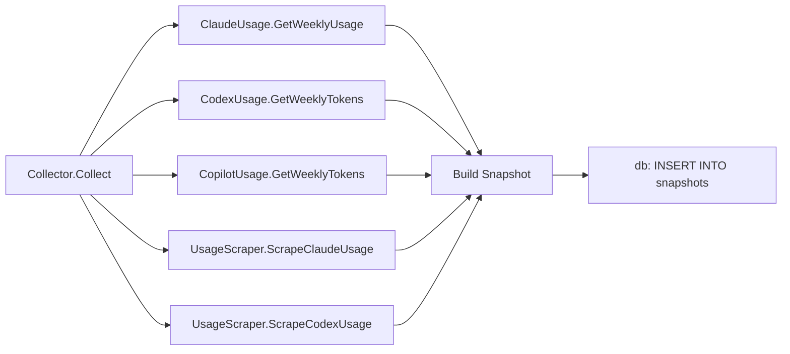

# State and Snapshots

How Nightshift tracks run history, staleness, and token usage over time.

## Overview

Three packages collaborate to give the system memory:

| Package | Purpose |
|---------|---------|
| `internal/state` | Per-project/per-task run history, staleness, assigned tasks |
| `internal/snapshots` | Periodic token usage snapshots from each provider |
| `internal/calibrator` | Infers the weekly token budget from snapshot history |

---

## Run State (`internal/state`)

```go
type State struct {
    mu sync.RWMutex
    db *db.DB
}
```

All public methods on `State` are concurrency-safe (read/write mutex). The DB
is the single source of truth; there is no in-memory cache.

### RunRecord

```go
type RunRecord struct {
    ID         string
    StartTime  time.Time
    EndTime    time.Time
    Provider   string
    Project    string
    Tasks      []string
    TokensUsed int
    Status     string  // success | failed | partial
    Error      string
    Branch     string
}
```

Records are inserted on every run and are used for:
- `nightshift stats` — historical summaries
- `nightshift status` — current run state
- Staleness scoring in the task selector

### ProjectState

```go
type ProjectState struct {
    Path        string
    LastRun     time.Time
    TaskHistory map[string]time.Time  // task type → last successful run
    RunCount    int
}
```

`State.RecordProjectRun` upserts the `projects` table row with the current
timestamp and increments `run_count`.

### Staleness Bonus

```go
func (s *State) StalenessBonus(project, taskType string) float64
```

Returns `days_elapsed × 0.1`, where `days_elapsed` is the number of full
days since `TaskHistory[taskType]` was last recorded. If the task has never
run, the calculation uses a large default value (treated as very stale).

### Assigned Tasks

When the orchestrator hands a task to an agent, it records an `AssignedTask`
row with `AssignedAt`. This prevents a second scheduler tick from starting
the same task concurrently while the first run is still in-flight.

---

## Usage Snapshots (`internal/snapshots`)

The `Collector` runs on a configurable schedule (typically every 30 minutes
while the daemon is running) and captures a point-in-time snapshot of each
provider's token usage.

### Snapshot Fields

```go
type Snapshot struct {
    Provider         string
    Timestamp        time.Time
    WeekStart        time.Time
    LocalTokens      int64      // tokens counted locally
    LocalDaily       int64      // tokens counted today
    ScrapedPct       *float64   // optional: % scraped from tmux session
    InferredBudget   *int64     // optional: budget inferred at snapshot time
    DayOfWeek        int
    HourOfDay        int
    WeekNumber       int
    Year             int
    SessionResetTime string     // scraped reset time for 5-hour window
    WeeklyResetTime  string     // scraped reset time for weekly window
}
```

### Collection Flow



`UsageScraper` is the tmux scraping layer (`internal/tmux`). It reads the
running provider CLI's terminal output to capture the usage percentage shown
in the interactive UI — this is more accurate than local token counting alone.

### HourlyAverage

The snapshots table enables queries like:

```go
type HourlyAverage struct {
    Hour           int
    AvgDailyTokens float64
}
```

The trend analyser uses `HourlyAverage` slices to predict daytime usage and
reserve tokens before Nightshift runs overnight.

---

## Calibrator (`internal/calibrator`)

The calibrator answers: *"What is the user's weekly token budget?"* without
requiring manual configuration.

### Algorithm

1. Load the last N weekly samples for the provider.
2. Find weeks where usage reached near 100% — the `LocalTokens` value at
   that point is a close proxy for the actual subscription limit.
3. Compute the median inferred budget, weighted by recency.
4. Return a `CalibrationResult` with confidence based on sample count and
   variance.

```go
type CalibrationResult struct {
    InferredBudget int64    // estimated weekly token budget
    Confidence     string   // high | medium | low | none
    SampleCount    int
    Variance       float64
    Source         string   // snapshots | api | config
}
```

### Confidence Levels

| Level | Condition |
|-------|-----------|
| `high` | `billing_mode: api` — budget is exact |
| `medium` | ≥4 samples, variance < threshold |
| `low` | 1–3 samples, or high variance |
| `none` | `calibrate: false` or no samples yet |

When confidence is `none`, the calibrator returns the static `weekly_budget`
from config.

### Config

```yaml
budget:
  calibrate: true
  # If calibrate: false, this value is used directly:
  weekly_budget: 70000
```

### BillingMode

When `billing_mode: api`, the calibrator short-circuits and returns the
configured `providers.<name>.budget` value with `confidence: high`. No
snapshot history is needed.

---

## Database Tables

| Table | Description |
|-------|------------|
| `projects` | One row per project path; `last_run`, `run_count` |
| `task_history` | One row per `(project, task_type)`; `last_run` |
| `runs` | One row per `RunRecord` |
| `assigned_tasks` | In-flight tasks; cleared on completion |
| `snapshots` | One row per `Snapshot`; used by calibrator + trend analyser |

All tables are created and migrated by `internal/db/migrations.go`.

---

## Testing Tips

- Use `db.Open(":memory:")` for an in-memory database that runs all migrations
  automatically.
- Inject `nowFunc` on `Calibrator` (internal field) or pass a controlled
  `time.Time` in snapshot data to simulate different days/weeks.
- `state.StalenessBonus` is deterministic given a fixed current time — mock
  the clock if exact score values matter in tests.
