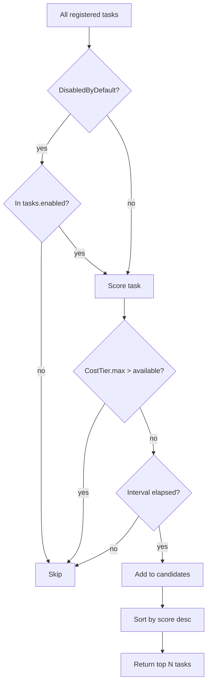

# Task System Internals

How Nightshift defines, scores, and selects tasks to run each night.

## Packages

| Package | Responsibility |
|---------|---------------|
| `internal/tasks/tasks.go` | Type definitions: `TaskDefinition`, `CostTier`, `RiskLevel`, `TaskCategory` |
| `internal/tasks/register.go` | Task registry + `RegisterCustomTasksFromConfig` |
| `internal/tasks/selector.go` | Priority scoring and task selection |

## Task Definition

```go
type TaskDefinition struct {
    Type             TaskType     // unique identifier, e.g. "fix-failing-tests"
    Category         TaskCategory // PR, Analysis, Options, Safe, Map, Emergency
    Name             string
    Description      string
    CostTier         CostTier   // Low, Medium, High, VeryHigh
    RiskLevel        RiskLevel  // Low, Medium, High
    DefaultInterval  time.Duration
    DisabledByDefault bool
}
```

### CostTier

Estimates the token range for a single run of the task:

| Tier | Token Range |
|------|------------|
| `CostLow` | 10 K – 50 K |
| `CostMedium` | 50 K – 150 K |
| `CostHigh` | 150 K – 500 K |
| `CostVeryHigh` | 500 K – 1 M |

The budget check uses the **max** of the tier range as a conservative estimate
before starting a task. If the available budget is below the max, the task is
skipped.

### RiskLevel

| Level | Meaning |
|-------|---------|
| `RiskLow` | Read-only or additive changes |
| `RiskMedium` | Modifies files, but changes are small and reversible |
| `RiskHigh` | Large refactors, dependency upgrades, schema changes |

### TaskCategory

Categories communicate the *type of output* the task produces, not the topic:

| Category | Output contract | Example tasks |
|----------|-----------------|---------------|
| `CategoryPR` | Fully-formed, review-ready PRs | `fix-failing-tests`, `update-dependencies` |
| `CategoryAnalysis` | Completed analysis with conclusions | `security-audit`, `dead-code-finder` |
| `CategoryOptions` | Surfaces judgment calls with tradeoffs | `refactoring-options` |
| `CategorySafe` | Required execution, no lasting side effects | `benchmark-run` |
| `CategoryMap` | Pure context laid out cleanly | `codebase-summary` |
| `CategoryEmergency` | Urgent issues that must block the queue | `fix-failing-tests` (when CI is red) |

## Registry

All built-in task definitions are held in a package-level `registry` map
(`map[TaskType]TaskDefinition`). A second map `customTypes` tracks which
entries were added via `RegisterCustom`.

### Registering Custom Tasks

From config (`tasks.custom`):

```yaml
tasks:
  custom:
    - type: generate-api-docs
      name: "Generate API Docs"
      description: "Run swaggo and commit updated OpenAPI spec"
      category: pr
      cost_tier: low
      risk_level: low
      interval: 168h    # weekly
```

`RegisterCustomTasksFromConfig` converts each entry into a `TaskDefinition` and
calls `RegisterCustom`. If any registration fails (duplicate type), all
previously registered tasks from that batch are rolled back atomically.

Parsing helpers apply case-insensitive matching with sensible defaults:

| Field | Default if empty/unknown |
|-------|--------------------------|
| `category` | `CategoryAnalysis` |
| `cost_tier` | `CostMedium` |
| `risk_level` | `RiskMedium` |
| `interval` | category default (see below) |

### Default Intervals by Category

| Category | Default interval |
|----------|-----------------|
| `CategoryPR` | 24 h |
| `CategoryAnalysis` | 72 h |
| `CategoryOptions` | 168 h (weekly) |
| `CategorySafe` | 24 h |
| `CategoryMap` | 168 h |
| `CategoryEmergency` | 1 h |

## Selector and Priority Scoring

```go
type Selector struct {
    cfg             *config.Config
    state           *state.State
    contextMentions map[string]bool  // tasks mentioned in CLAUDE.md/AGENTS.md → +2
    taskSources     map[string]bool  // tasks from td/GitHub issues → +3
}
```

### Scoring Formula

```
score = base_priority + staleness_bonus + context_bonus + task_source_bonus
```

| Component | Value |
|-----------|-------|
| `base_priority` | From `cfg.GetTaskPriority(taskType)` (config-driven, default 0) |
| `staleness_bonus` | `days_since_last_run × 0.1` (from `state.StalenessBonus`) |
| `context_bonus` | `+2` if the task name appears in CLAUDE.md or AGENTS.md |
| `task_source_bonus` | `+3` if the task originated from a `td` issue or GitHub issue |

Tasks are ranked by score (descending), then filtered by:
1. Budget — skip tasks whose `CostTier.max` exceeds available tokens
2. Cooldown — skip tasks whose `DefaultInterval` has not elapsed since last run
3. Disabled — skip tasks with `DisabledByDefault: true` unless explicitly listed in `tasks.enabled`

### ScoredTask

```go
type ScoredTask struct {
    Definition TaskDefinition
    Score      float64
    Project    string
}
```

## Staleness Calculation

`state.StalenessBonus(project, taskType)` queries the database for the last
successful run of `(project, taskType)` and returns:

```
bonus = days_elapsed × 0.1
```

A task not run in 10 days earns +1.0 on top of its base priority, nudging it
ahead of freshly-run tasks.

## Disabled-by-Default Tasks

Tasks with `DisabledByDefault: true` are never run unless the operator
explicitly lists them in:

```yaml
tasks:
  enabled:
    - very-expensive-refactor
    - schema-migration
```

`DefaultDisabledTaskTypes()` returns the list of all such task types, which
the `nightshift task` CLI command uses to warn the operator.

## Preview Mode

`Selector.SetSimulatedCooldowns(keys)` marks `task:project` pairs as if they
were on cooldown, allowing `nightshift preview` to show which tasks would
*actually* run vs be skipped without modifying real state.

## Flow Diagram


