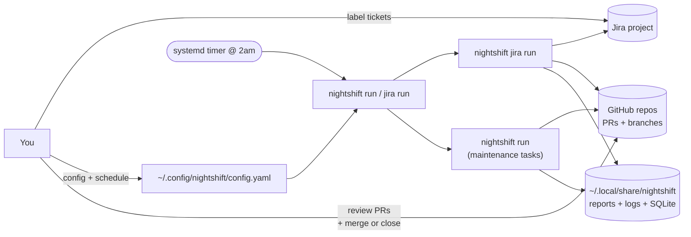

# Introduction

Nightshift is a Go CLI that runs AI coding agents (Claude Code, Codex, GitHub Copilot) on your repos overnight.

Two flagship workflows:

1. **Autonomous Jira pipeline** — fetch labeled todo tickets, validate, plan, implement, commit, push a PR, transition status. End-to-end ticket lifecycle, fully autonomous, resumable across runs via `🤖` Jira comments. **This is the headline use case.** See [Jira Pipeline](jira-pipeline.md).
2. **Maintenance task catalog** — ~60 built-in tasks (lint, docs, tests, bug-finding, refactors, security audits, bus-factor analysis, ...). Runs on a schedule, uses leftover provider budget. See [Tasks](tasks.md).

> It finds what you forgot to look for — and it ships your tickets while you sleep.

## Core Principles

- **Everything is a PR.** Nightshift never writes directly to your primary branch. Every change is a branch + PR. Don't like it? Close it.
- **Resumable.** Jira phases post `🤖` comment markers. Crashes / timeouts / interruptions don't restart from scratch — they pick up at the next unfinished phase.
- **Budget-aware.** Live provider Usage API checks gate every run. Single knob: `max_percent` (default 90%).
- **Multi-project, multi-repo.** Each Jira project can target multiple repos; each repo gets its own workspace.
- **No CGO, no cloud.** Pure-Go SQLite, all state on disk.

## How It Fits Together



## What a Typical Night Looks Like

```
22:00  systemd timer fires → nightshift jira run + nightshift run
       ├─ jira run
       │    fetch labeled todo tickets in VC project
       │    BuildDependencyGraph → topo-sort
       │    for each ticket:
       │       validate (LLM scores 7/10) → plan → implement → commit → PR → status
       │       post 🤖 comments after each successful phase
       │       fail? → 🤖 error comment, move to next ticket
       └─ task run (if budget remains)
            select highest-priority eligible task
            run it on the next project in priority order

07:30  you wake up
       ├─ 3 new PRs on github.com/org/repo
       ├─ 3 Jira tickets transitioned to "In Review"
       └─ a run report at ~/.local/share/nightshift/reports/
```

## Quick Start

```bash
brew install marcus/tap/nightshift
nightshift setup                  # configure providers + projects + Jira
export NIGHTSHIFT_JIRA_TOKEN=...   # Atlassian API token
nightshift jira preview            # dry-run: see what would happen
nightshift jira run                # process all labeled tickets
```

For the maintenance-task workflow:

```bash
nightshift preview
nightshift run
```

## Next

- [Installation](installation.md)
- [Quick Start](quick-start.md)
- [Jira Pipeline](jira-pipeline.md) — start here if Jira is your primary use case
