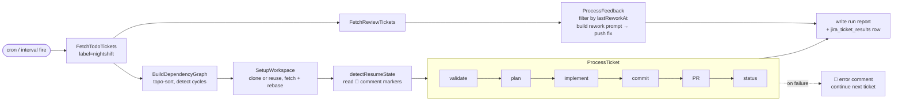
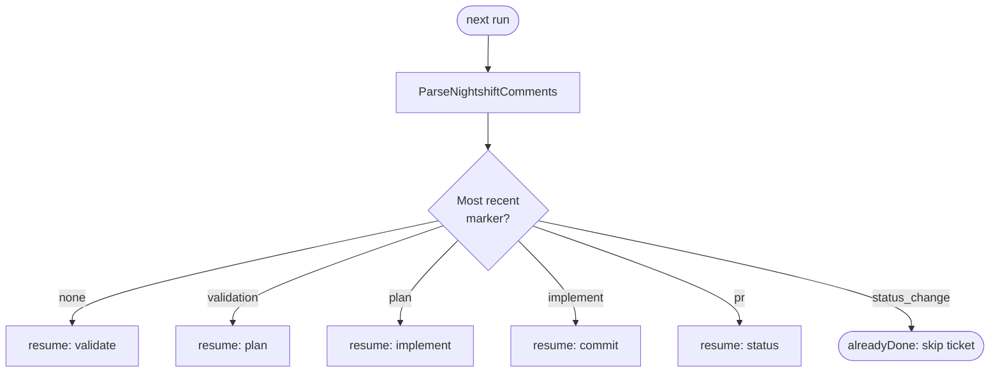

# Jira Pipeline

**The headline feature.** Nightshift autonomously implements Jira tickets end-to-end: fetch → validate → plan → implement → commit → PR → status transition. One command, overnight, every labeled ticket.

```bash
nightshift jira run
```

That's it. Set a schedule + walk away. By morning the work is in PRs.



---

## What It Does

For each labeled ticket in todo status, Nightshift:

| # | Phase | What happens | Posts comment? |
|---|-------|--------------|----------------|
| 1 | **Validate** | LLM scores ticket clarity (0–10). Score < 6 → `🤖 rejection` comment + transition to "Needs Info" + stop. | yes (validation or rejection) |
| 2 | **Setup workspace** | Clone repo (or reuse existing clone). `git fetch && git checkout -B feature/<KEY> origin/<base>`. | no |
| 3 | **Plan** | LLM produces structured plan from ticket + parent epic + repo state. | yes (plan) |
| 4 | **Implement** | LLM edits files. Plan is injected as a `Plan` section in the prompt. | yes (implement) |
| 5 | **Commit** | Conventional Commits (`feat`/`fix`/...), `Refs: TICKET-KEY` in body. No commit if no diff. | no |
| 6 | **PR** | `gh pr create` or `gh pr edit` (filtered to `--state open`). Body links the ticket + summarises the plan. | yes (pr) |
| 7 | **Status** | Transition ticket → "In Review". | yes (status_change) |

Failures at any phase post a `🤖 error` comment with the phase name + error text. The pipeline stops on the ticket; other tickets continue.

For tickets already in **In Review**, `ProcessFeedback` fetches new PR review comments (filtered by `lastReworkAt` so each comment is acted on once), builds a rework prompt, runs the implement agent, and pushes a fix commit + `🤖 rework` Jira comment.

---

## Resume Logic

The validate, plan, implement, PR, and status phases each post a `🤖 <!-- nightshift:type=<phase> -->` HTML marker. On the next run, `detectResumeState` reads those markers and resumes from the next unfinished phase:




| Last marker seen | Resume from |
|------------------|-------------|
| (none) | validate |
| validation | plan |
| plan | implement |
| implement | commit |
| pr | status |
| status_change | done — skip ticket |

Workspace is reused. Edits in the working tree from a prior partial run remain in place — the resuming agent sees them as starting state.

To force a full restart, transition the ticket back to "Todo" (or your project's todo equivalent — e.g. "À faire" in French). `FetchTodoTickets` will pick it up fresh and `detectResumeState` will see no markers.

---

## Dependency Resolution

If tickets carry `blocks` / `is blocked by` issue links, `BuildDependencyGraph` builds the graph and `ResolveOrder` returns a topo-sorted slice. Cycles abort the run. Blocked tickets defer until their blockers are done in the same run (or were already closed).

---

## Configuration

```yaml
jira:
  site: yourorg                          # yourorg.atlassian.net
  email: you@example.com
  token_env: NIGHTSHIFT_JIRA_TOKEN       # env var holding the API token

  # ─── Global per-phase agent config (overridable per project) ───
  validation:
    provider: copilot
    model: gpt-5.4-mini
    timeout: 2m
  plan:
    provider: copilot
    model: claude-sonnet-4.6
    timeout: 5m
  implement:
    provider: copilot
    model: claude-sonnet-4.6
    timeout: 30m
  review_fix:
    provider: copilot
    model: gpt-5.4-mini
    timeout: 20m

  budget_enabled: true                   # gate runs on provider budget
  max_tickets: 10                        # cap per run

  # ─── Projects ───
  projects:
    - key: VC
      label: nightshift                  # JQL: project = VC AND labels = nightshift AND status in todo
      repos:
        - name: nightshift
          url: git@github.com:org/nightshift.git    # SSH required (HTTPS hangs in non-interactive contexts)
          base_branch: main

    - key: INFRA
      label: nightshift
      repos:
        - name: infra
          url: git@github.com:org/infra.git
          base_branch: trunk
      implement:
        timeout: 45m                     # per-project phase override
```

### Required Setup

1. **Jira label.** Add a label (default `nightshift`) to every ticket you want Nightshift to pick up.
2. **API token.** [Generate at id.atlassian.com](https://id.atlassian.com/manage-profile/security/api-tokens). Export as `NIGHTSHIFT_JIRA_TOKEN`.
3. **SSH remote.** Repos must use `git@github.com:org/repo.git` URLs. HTTPS fails silently with `fatal: could not read Username`.
4. **`gh` auth.** `gh auth login` so Nightshift can `gh pr create` / `gh pr edit`.
5. **Permissions.** Set `dangerously_skip_permissions: true` (Claude) / `dangerously_bypass_approvals_and_sandbox: true` (Codex/Claude). Without these, the implement phase halts asking for approval and the run produces no changes.

### Sprint / Backlog Filtering

Nightshift automatically excludes backlog and future-sprint tickets — no config needed.

**Automatic (always on):**
- **Backlog exclusion** — the agile board for each project is auto-discovered via the Jira API. Tickets in the board's backlog are always excluded. If a project has no agile board (e.g. Jira Work Management), backlog filtering is skipped gracefully.
- **Future-sprint exclusion** — `AND (sprint not in futureSprints() OR sprint is EMPTY)` is always appended to the todo JQL. The `OR sprint is EMPTY` arm is required for Kanban boards — Jira's `sprint not in futureSprints()` silently excludes tickets with no sprint. Requires Jira Software license; Work Management projects will receive a JQL error if this function is unavailable.

**Optional (via config):**

```yaml
jira:
  projects:
    - key: VC
      require_active_sprint: true  # add: AND sprint in openSprints() — Jira Software only
```

| Flag | Effect | Requires |
|---|---|---|
| `require_active_sprint: true` | Append `AND sprint in openSprints()` to todo JQL | Jira Software |

- `require_active_sprint: true` adds `AND sprint in openSprints()` to the todo JQL. Applied only to the todo fetch — in-flight and review tickets are unaffected. Requires Jira Software (not Work Management).

### Localised status names

Status names from the Jira API are checked by substring keyword. Examples:

- French VC project: "À faire" (todo), "En cours" (in-progress), "Revue en cours" (review), "Terminé" (done). `isReviewStatus` matches "revue" → classifies correctly.
- If your project uses non-English statuses, no extra config required — keywords are normalised at discovery time via `DiscoverStatuses`.

---

## CLI

```bash
# Run
nightshift jira run                          # all labeled tickets, all projects
nightshift jira run --project VC             # only the VC project (mirrors jira preview -p)
nightshift jira run -p VC                    # short form
nightshift jira run --ticket VC-42           # one ticket
nightshift jira run --max-tickets 5
nightshift jira run --label other-label
nightshift jira run --skip-validation        # skip the LLM scoring phase (saves tokens)
nightshift jira run --todo-only              # process todo only, skip review-feedback loop
nightshift jira run --review-only            # only handle PR review feedback

# Preview (dry-run, no Jira mutation, no git push)
nightshift jira preview                      # summary: tickets, phase plan, budget
nightshift jira preview --validate           # also run LLM validation per ticket (costs tokens)
nightshift jira preview --explain            # full budget + per-phase token estimate
nightshift jira preview --project VC         # override project key
nightshift jira preview --type Bug           # filter by issue type
nightshift jira preview --json
nightshift jira preview --plain              # no TUI pager
```

See [CLI Reference](cli-reference.md) for the full flag table.

---

## What You Wake Up To

Per ticket processed:

- A `feature/<KEY>` branch pushed to the configured repo
- A PR linking back to the ticket, plan summary in the body
- The Jira ticket transitioned to "In Review"
- A trail of `🤖` comments on the Jira ticket: plan, implementation summary, PR URL, status change

Per run:

- A markdown report at `~/.local/share/nightshift/reports/run-YYYY-MM-DD-HHMMSS.md` with per-ticket outcomes, token cost, PR URLs, errors
- An entry in `jira_ticket_results` (SQLite) for trend / replay queries

Don't like a PR? Close it. The Jira ticket can be moved back to Todo to retry. Workspace is reused; commit history is preserved on the branch.

---

## Environment

| Var | Purpose |
|-----|---------|
| `NIGHTSHIFT_JIRA_TOKEN` | Jira API token (mandatory) |
| `ANTHROPIC_API_KEY` | Claude provider auth (if Claude is used in any phase) |
| `OPENAI_API_KEY` | Codex provider auth (if Codex is used in any phase) |
| `GH_TOKEN` / `gh auth` | GitHub Copilot auth + `gh` PR operations |

---

## Common Failure Modes

| Symptom | Cause | Fix |
|---------|-------|-----|
| `fatal: could not read Username` | HTTPS remote in non-interactive context | Switch to `git@github.com:...` |
| Implement phase produces no diff | Agent halted on permission prompt | Set `dangerously_skip_permissions` / `dangerously_bypass_approvals_and_sandbox` |
| Resume restarts from validate | `🤖` markers missing/malformed | Verify comments contain `🤖` prefix + `<!-- nightshift:type=... -->` HTML comment |
| New PR opened on closed branch | `findExistingPR` not filtering `--state open` | Already fixed in VC-44 — make sure you're on a recent build |
| Ticket stuck in "In Progress" | Commit phase failed; `TransitionToReview` never reached | Check error comment; fix root cause; re-run |
| Backlog tickets included on Kanban | Missing `board_id` + `board_type: kanban` | Add both (label-only JQL can't separate board from backlog) |

---

## Single-Instance Lock

`nightshift jira run` enforces one running instance per host using an atomic PID lock file at:

```
~/.local/share/nightshift/jira-run.lock
```

If a second invocation tries to run while one is active, it exits non-zero immediately:

```
Error: lock held by another process: another jira run in progress, PID 12345, started at 2026-05-23T22:00:00+02:00
```

### `--wait`

Pass `--wait <duration>` to block instead of failing:

```bash
nightshift jira run --wait 10m   # wait up to 10 minutes for the running instance to finish
```

The wait uses exponential backoff (500ms → 10s cap). SIGINT/SIGTERM cancels the wait.

### Stale lock recovery

If the process that held the lock died without releasing it (e.g. `kill -9`), the next `jira run` detects the dead PID, logs a warning, reclaims the file, and proceeds normally.

### NFS / shared HOME

`O_EXCL` is not atomic across NFS mounts. The lock is per-host only — do not run Nightshift against a shared `$HOME` from multiple hosts simultaneously.

---

## See Also

- [Quick Start](quick-start.md) — basic Nightshift setup before adding Jira
- [Agents](agents.md) — provider-specific model/timeout tuning
- [Configuration](configuration.md) — full YAML reference
- [Jira Pipeline Internals](../dev/jira-pipeline.md) — phase state machine, code-level detail
- [Workspace Management](../dev/workspace.md) — clone/branch/push conventions
- [Troubleshooting](troubleshooting.md) — generic error catalog
