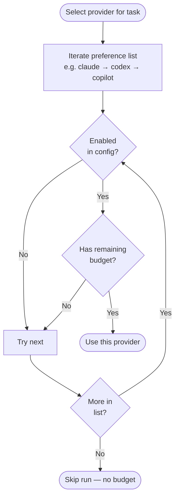

# Agent Integrations

Nightshift supports three AI coding agents as execution backends. Each agent corresponds to an external CLI binary that Nightshift spawns to perform coding tasks. You need at least one installed and authenticated.

| Agent | Binary | Provider | Auth |
|-------|--------|----------|------|
| Claude Code | `claude` | Anthropic | Subscription or `ANTHROPIC_API_KEY` |
| Codex | `codex` | OpenAI | Subscription or `OPENAI_API_KEY` |
| GitHub Copilot | `gh` + copilot extension | GitHub | `gh auth login` |

---

## Claude Code

### Install

```bash
npm install -g @anthropic-ai/claude-code
```

Or download the binary from [claude.ai/code](https://claude.ai/code).

### Authenticate

```bash
# Subscription login (interactive)
claude
/login

# API key (headless)
export ANTHROPIC_API_KEY=sk-ant-...
```

### How Nightshift invokes it

```
claude --print [--dangerously-skip-permissions] [--model <model>] <prompt>
```

- `--print` — non-interactive mode; outputs result and exits
- `--dangerously-skip-permissions` — skips permission prompts for autonomous file writes; required for the Jira implement phase
- `--model` — selects which Claude model to use (e.g. `claude-sonnet-4-5`, `claude-opus-4-5`)

File context (when reading project files for hints) is injected via stdin.

### Config block

```yaml
providers:
  preference:
    - claude
  claude:
    enabled: true
    data_path: "~/.claude"                 # Claude data directory
    dangerously_skip_permissions: false    # Set true for Jira implement phase
```

### Supported models

Any model accepted by the `claude` CLI. Common values:

- `claude-sonnet-4-5` (default, fast + capable)
- `claude-opus-4-5` (highest quality, slower)
- `claude-haiku-4-5` (fastest, cheapest)

Specify per-phase in the Jira config:

```yaml
jira:
  implement:
    provider: claude
    model: claude-sonnet-4-5
    timeout: 30m
```

---

## Codex

### Install

```bash
npm install -g @openai/codex
```

### Authenticate

```bash
# Interactive login
codex --login

# API key (headless)
export OPENAI_API_KEY=sk-...
```

### How Nightshift invokes it

```
codex exec [--dangerously-bypass-approvals-and-sandbox] [--model <model>] <prompt>
```

- `exec` — non-interactive execution subcommand
- `--dangerously-bypass-approvals-and-sandbox` — bypasses approval prompts; enabled by default in Nightshift for autonomous operation
- `--model` — selects which OpenAI model to use (e.g. `codex-mini-latest`, `gpt-4o`)

File context is injected via stdin.

### Config block

```yaml
providers:
  codex:
    enabled: true
    data_path: "~/.codex"
    dangerously_bypass_approvals_and_sandbox: true
```

### Supported models

Any model accepted by the `codex` CLI:

- `codex-mini-latest` — fast, optimized for code edits
- `gpt-4o` — general purpose
- `o4-mini` — reasoning model, slower

---

## GitHub Copilot

### Install

GitHub Copilot requires the `gh` CLI and the copilot extension:

```bash
# Install gh CLI
brew install gh             # macOS
# or: https://cli.github.com/

# Install the Copilot extension
gh extension install github/gh-copilot
```

Alternatively, install the standalone `copilot` binary:

```bash
npm install -g @github/copilot-cli
```

### Authenticate

```bash
gh auth login
```

A GitHub account with an active Copilot subscription (Individual or Business) is required.

### How Nightshift invokes it

**Via `gh` (default):**
```
gh copilot -- -p <prompt> --no-ask-user --silent [--model <model>] [--allow-all-tools --allow-all-urls]
```

**Via standalone `copilot` binary:**
```
copilot -p <prompt> --no-ask-user --silent [--model <model>] [--allow-all-tools --allow-all-urls]
```

Key flags:
- `-p` — non-interactive prompt mode; agent runs and exits
- `--no-ask-user` — disables the `ask_user` tool; fully autonomous
- `--silent` — outputs only the agent response (suppresses stats/metadata)
- `--model` — selects the model (e.g. `gpt-5.4-mini`, `claude-sonnet-4.6`)
- `--allow-all-tools --allow-all-urls` — grants broad tool access for autonomous operation; enabled when `dangerously_skip_permissions: true`

File context is injected via stdin.

### Config block

```yaml
providers:
  copilot:
    enabled: true
    dangerously_skip_permissions: true    # Passes --allow-all-tools --allow-all-urls
```

To use a standalone `copilot` binary instead of `gh copilot`, set:

```yaml
providers:
  copilot:
    binary_path: "copilot"
```

### Supported models

Any model accessible via your Copilot subscription. Common values:

- `gpt-5.4-mini` — fast, good for validation and review-fix phases
- `gpt-5.4` — general purpose
- `claude-sonnet-4.6` — Anthropic model via Copilot
- `claude-opus-4-5` — highest quality via Copilot

The Jira pipeline commonly uses Copilot with different models per phase:

```yaml
jira:
  validation:
    provider: copilot
    model: gpt-5.4-mini
    timeout: 2m
  plan:
    provider: copilot
    model: claude-sonnet-4.6
    timeout: 5m
  implement:
    provider: copilot
    model: claude-sonnet-4.6
    timeout: 30m
  review_fix:
    provider: copilot
    model: gpt-5.4-mini
    timeout: 20m
```

---

## Provider Selection

When multiple providers are enabled, Nightshift selects them in the order specified by `preference`, skipping providers with no remaining budget:



```yaml
providers:
  preference:
    - claude
    - codex
    - copilot
```

For the Jira pipeline, each phase specifies its own provider explicitly — the preference order is not used.

---

## Checking Agent Availability

```bash
nightshift doctor
```

`nightshift doctor` checks which agent binaries are in `PATH`, verifies authentication, and reports any configuration issues.

---

## Troubleshooting

### Agent binary not found

```
agent "claude" not available: exec: "claude": executable file not found in $PATH
```

Install the binary and ensure it is in your `PATH`.

### Permission prompts block execution

If Claude or Codex halts mid-run asking for approval:

- **Claude**: set `dangerously_skip_permissions: true` in the `claude:` config block, or pass `--dangerously-skip-permissions` manually
- **Codex**: `--dangerously-bypass-approvals-and-sandbox` is on by default; ensure you haven't disabled it

### Copilot ask_user tool interrupts run

The Copilot agent may ask for user confirmation during tool calls. `--no-ask-user` is always passed by Nightshift, but if you see this behaviour, verify the extension version is up to date:

```bash
gh extension upgrade copilot
```

### Authentication expired

Re-authenticate:

```bash
claude /login            # Claude
codex --login            # Codex
gh auth login            # Copilot
```

### Wrong model causes errors

Check the model name is supported by your subscription. Use `nightshift preview` to see which models would be used before running.
