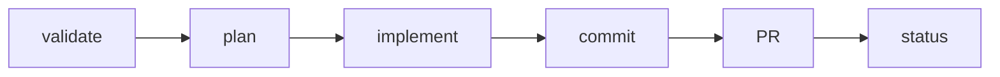
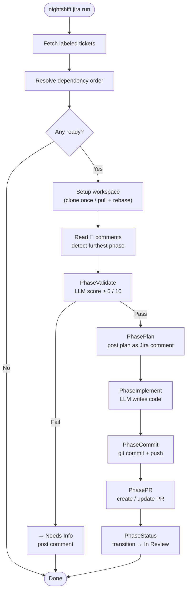
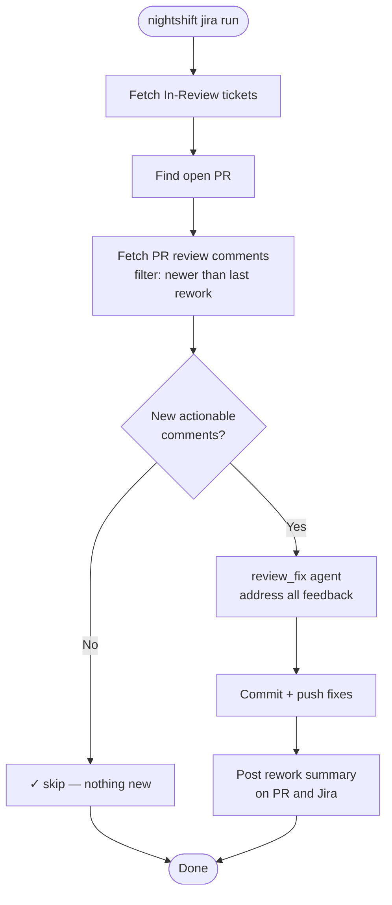

# Jira Autonomous Pipeline

Nightshift can autonomously implement Jira tickets overnight. It validates the ticket, plans the implementation, writes code, commits, opens a PR, and transitions the Jira status — all without human intervention.

## How It Works

Each ticket goes through six phases:



| Phase | What happens |
|-------|-------------|
| **validate** | LLM reviews the ticket for clarity, completeness, and testability. Score ≥ 6/10 passes. |
| **plan** | LLM produces an implementation plan posted as a Jira comment. |
| **implement** | LLM writes code in the feature branch workspace. |
| **commit** | Changes are committed and pushed to `feature/{TICKET-KEY}`. |
| **PR** | A GitHub PR is opened (or updated) linking to the Jira ticket. |
| **status** | Jira ticket transitions to "In Review". |

Progress is posted as `🤖` comments on the Jira ticket after each phase. On the next run, Nightshift reads these comments to resume from the furthest completed phase — no work is duplicated.



## Setup

### 1. Configure Jira credentials

```bash
export NIGHTSHIFT_JIRA_TOKEN="your-api-token"
```

Find or create a token at: https://id.atlassian.com/manage-profile/security/api-tokens

### 2. Add config

```yaml
jira:
  site: "https://yourorg.atlassian.net"
  email: "you@example.com"
  project: "PROJ"
  label: "nightshift"

  # Phases — configure provider/model/timeout per phase
  validation:
    provider: copilot
    model: gpt-5.4-mini
    timeout: 2m
  plan:
    provider: copilot
    model: claude-sonnet-4.6
    timeout: 5m
  implement:
    provider: copilot
    model: claude-sonnet-4.6
    timeout: 30m
  review_fix:
    provider: copilot
    model: gpt-5.4-mini
    timeout: 20m

  # Workspace (repos cloned here; reused across runs)
  workspace_root: "~/.local/share/nightshift/jira-workspaces"
  cleanup_after_days: 14

  # Repos the agent will operate on (SSH URL required)
  repos:
    - name: myrepo
      url: "git@github.com:org/myrepo.git"
      base_branch: main
```

### 3. Label your tickets

Add the `nightshift` label (or the label set in `jira.label`) to any ticket you want Nightshift to process.

### 4. Preview first

```bash
nightshift jira preview
```

This shows which tickets are ready, blocked, or awaiting review — without making any changes.

### 5. Run

```bash
nightshift jira run
```

## Ticket Requirements

A ticket must have:
- A clear **summary** (title)
- A **description** explaining what needs to be done
- **Acceptance criteria** (explicit or implied)

Validation checks for:
- Is the scope clear? Can an agent implement it without guessing?
- Are acceptance criteria testable?
- Is there enough context?

A score < 6/10 marks the ticket as "Needs Info" and posts feedback on what's missing.

## Workspace Reuse

Workspaces are persistent per ticket:

```
~/.local/share/nightshift/jira-workspaces/
  PROJ-42/
    myrepo/   ← cloned once, reused on subsequent runs
```

On each run, `git fetch origin` + `git pull --rebase` syncs the branch. Stale workspaces (unmodified for `cleanup_after_days` days) are removed automatically.

## Resuming Interrupted Runs

If a run fails mid-phase (e.g., implement fails due to a bad model name), the next run resumes from that phase. Nightshift reads `🤖` comments on the ticket to determine the furthest completed phase.

To force a full restart: move the ticket back to "To Do" status in Jira.

## Review Feedback Loop

After a PR is opened and you or a reviewer leaves comments:



1. Nightshift detects review threads (inline comments, change requests)
2. The `review_fix` agent addresses the feedback
3. Changes are committed and pushed
4. A summary comment is posted on the PR and the Jira ticket

Nightshift only processes review comments posted **after the last review-fix comment** — no duplicate fixes.

Run review feedback processing:

```bash
nightshift jira run --review-only
```

## CLI Reference

```bash
nightshift jira run                     # Process all labeled tickets
nightshift jira run --ticket PROJ-42    # Process one ticket
nightshift jira run --max-tickets 5     # Limit tickets processed
nightshift jira run --skip-validation   # Skip LLM validation phase
nightshift jira run --todo-only         # Only process TODO tickets
nightshift jira run --review-only       # Only process review feedback

nightshift jira preview                 # Dry-run: show what would happen
nightshift jira preview --plain         # No TUI pager
nightshift jira preview --json          # JSON output
```

## Dependency Handling

Nightshift reads Jira issue links. A ticket blocked by another ticket is skipped until the blocker is resolved. Tickets whose blocker is already **Done** are treated as unblocked.

`nightshift jira preview` shows the execution order with blocked tickets clearly marked.

## Troubleshooting

See [Troubleshooting — Jira Pipeline Issues](/docs/troubleshooting#jira-pipeline-issues).
